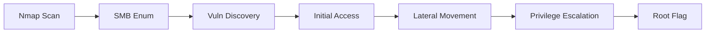

# Writeup Creation Instructions

This document provides detailed instructions for converting Obsidian notes into professional writeups for the Rootinator blog.

---

## Overview

Writeups should follow the established format demonstrated in `_writeups/Blackfield.md`. The goal is to transform raw notes into polished, professional content while maintaining technical accuracy and readability.

---

## File Structure

### Naming Convention
```
_writeups/{platform}-{machinename}.md
```

**Examples:**
- `_writeups/Blackfield.md` (HTB boxes use capital first letter)
- `_writeups/htb-flight.md` (Alternative lowercase format)
- `_writeups/thm-windows-basic.md`

### Directory Structure
```
Rootinator/
├── _writeups/
│   ├── Blackfield.md
│   ├── htb-flight.md
│   └── ...
├── assets/
│   ├── images/
│   │   └── (processed screenshots)
│   └── writeups/
│       └── icons/
│           └── Blackfield.png
└── obsidian-writeups/
    └── Attachments/
        └── (original screenshots)
```

---

## Frontmatter Template

```yaml
---
layout: writeup
title: {Machine Name}
platform: {HackTheBox|TryHackMe|VulnHub}
difficulty: {Easy|Medium|Hard|Insane}
box_icon: /assets/writeups/icons/{MachineName}.png
date: YYYY-MM-DD
tags:
  - {tag1}
  - {tag2}
  - {tag3}
os: {Windows|Linux}
ip: {target IP from notes}
---
```

**Required Fields:**
- `layout`: Always `writeup`
- `title`: Machine name (capitalize first letter)
- `platform`: Platform where the box is hosted
- `difficulty`: Official difficulty rating
- `date`: Date writeup was completed
- `os`: Operating system

**Optional but Recommended:**
- `box_icon`: Path to machine icon
- `ip`: Target IP address
- `tags`: Relevant techniques/vulnerabilities

---

## Content Structure

### 1. CSS Link (Required)

```html
<link rel="stylesheet" href="{{ '/assets/css/obsidian-dividers.css' | relative_url }}">
```

### 2. Summary Section

```markdown
## Summary

<div class="divider divider-info">
    <span class="divider-title">TL;DR</span>
    <span class="divider-content">{Brief 2-3 sentence overview of the entire attack chain}</span>
</div>

**Key Vulnerabilities:**
- {Vulnerability 1}
- {Vulnerability 2}
- {Vulnerability 3}
```

**Guidelines:**
- Keep TL;DR to 2-3 sentences maximum
- Focus on the attack flow, not implementation details
- List 2-5 key vulnerabilities in bullet points

### 3. Enumeration Section

```markdown
## Enumeration

### Nmap Scan

**Initial scan:**
```bash
nmap -vv -T5 -p- {target_ip}
```

**Results:**

| Port | Service  | TCP/UDP |
| ---- | -------- | ------- |
| 80   | HTTP     | TCP     |
| 443  | HTTPS    | TCP     |
| 22   | SSH      | TCP     |

**Key findings:**
- {Finding 1}
- {Finding 2}
```

**Guidelines:**
- Always include nmap commands used
- Use tables for port listings
- Add a "Key findings" section to highlight important discoveries
- Include service versions if relevant

### 4. Image References

**Format:**
```markdown

```

**Important:**
- Images must be copied from `obsidian-writeups/Attachments/` to `assets/images/`
- Rename images descriptively (not "Pasted image...")
- Use relative paths from the `_writeups/` directory
- Alt text is optional but recommended for accessibility

### 5. Dividers

Use custom dividers to highlight important sections:

**Info Divider** (explanations, context):
```html
<div class="divider divider-info">
    <span class="divider-title">Title</span>
    <span class="divider-content">Content explanation</span>
</div>
```

**Warning Divider** (vulnerabilities, exploitation paths):
```html
<div class="divider divider-warning">
    <span class="divider-title">Vulnerability</span>
    <span class="divider-content">Exploitation details</span>
</div>
```

**Root Divider** (shell access, flags):
```html
<div class="divider divider-root">
    <span class="divider-title">Root Access</span>
    <span class="divider-content">Successfully escalated privileges to root</span>
</div>
```

**When to use dividers:**
- TL;DR summary: `divider-info`
- Vulnerability explanations: `divider-info`
- Exploitation paths: `divider-warning`
- Shell obtained: `divider-root`
- Flags obtained: `divider-root`

### 6. Code Blocks

**Format:**
```markdown
```bash
# Command description
command --flags arguments
```
```

**Guidelines:**
- Always specify language (bash, powershell, python, etc.)
- Include comments for complex commands
- Show both commands AND relevant output when needed
- Use `# Command` comments to separate input from output

**Example:**
```markdown
```bash
# Enumerate SMB shares
❯ nxc smb 10.129.229.17 -u 'Guest' -p '' --shares
SMB         10.129.229.17   445    DC01             [*] Windows 10
SMB         10.129.229.17   445    DC01             [+] BLACKFIELD.local\Guest
```
```

### 7. Sections Order

Follow this standard order:

1. **Summary**
2. **Enumeration**
   - Nmap Scan
   - {Service} Enumeration (LDAP, SMB, HTTP, etc.)
3. **Initial Foothold** / **Initial Access**
   - Vulnerability Discovery
   - Exploitation
4. **User Flag**
5. **Lateral Movement** (if applicable)
6. **Privilege Escalation**
7. **Root Flag**
8. **Post-Exploitation** (optional)
9. **References**
10. **Timeline** (optional Mermaid diagram)

### 8. Flags Section

```markdown
## User Flag

**User flag location:**
```bash
cat /home/user/user.txt
3920bb317a0bef51027e2852be64b543
```

---

## Root Flag

```bash
cat /root/root.txt
4375a629c7c67c8e29db269060c955cb
```
```

**Or combine in Post-Exploitation:**
```markdown
## Post-Exploitation

**Flags:**
- User: `3920bb317a0bef51027e2852be64b543`
- Root: `4375a629c7c67c8e29db269060c955cb`
```

### 9. References Section

```markdown
## References

- [{Description} - {Source}]({URL})
- [AS-REP Roasting - HackTricks](https://book.hacktricks.xyz/...)
- [BloodHound - GitHub](https://github.com/BloodHoundAD/BloodHound)
```

**Guidelines:**
- Include links to tools used
- Reference exploit techniques with HackTricks/MITRE ATT&CK links
- Credit any PoCs or scripts used
- Link to relevant documentation

### 10. Timeline Diagram (Optional)

```markdown
## Timeline


```

### 11. Footer

```markdown
**Pwned on:** DD/MM/YYYY

**Difficulty Rating:** ⭐⭐⭐⭐ (Personal rating)  
**Fun Factor:** ⭐⭐⭐ (How enjoyable was it?)
```

---

## Image Processing Workflow

### From Obsidian Notes to Website

1. **Locate Images**
   - Original images are in: `obsidian-writeups/Attachments/`
   - Obsidian references: `![[Pasted image 20251021170110.png]]`

2. **Copy Images**
   - Destination: `assets/images/`
   - Rename descriptively if needed

3. **Update References**
   - Old: `![[Pasted image 20251021170110.png]]`
   - New: ``

4. **URL Encoding**
   - Spaces become `%20`
   - Special characters should be encoded

**Note:** For now, we reference images directly from the obsidian-notes branch on GitHub:
```markdown

```

---

## Writing Style Guidelines

### Tone
- **Professional but accessible**
- Use active voice
- Write in present tense for reproducibility
- Explain *why* things work, not just *what* to do

### Technical Depth
- **Assume intermediate knowledge**
- Explain uncommon techniques/tools
- Don't explain basic concepts (e.g., what nmap is)
- Do explain specific flags or technique variations

### Command Documentation
- Show the exact command used
- Include relevant output
- Explain complex flags
- Use comments for clarity

### Vulnerability Explanations
- Use info dividers for technical explanations
- Keep explanations to 2-3 sentences
- Link to external resources for deeper dives
- Focus on exploitation impact

---

## Conversion Process

### Step-by-Step Workflow

1. **Read Obsidian Notes**
   - Understand the full attack chain
   - Identify key vulnerabilities
   - Note all referenced images

2. **Create Structure**
   - Add frontmatter with all metadata
   - Include CSS link
   - Create section headers

3. **Write Summary**
   - Draft TL;DR (2-3 sentences)
   - List key vulnerabilities

4. **Process Enumeration**
   - Format nmap output as table
   - Add "Key findings" bullets
   - Include service-specific enumeration

5. **Document Exploitation**
   - Use dividers for vulnerabilities
   - Show commands and output
   - Explain technique choices

6. **Add Flags**
   - Show how flags were obtained
   - Include actual flag values

7. **Process Images**
   - Verify all images referenced exist
   - Update image paths
   - Add alt text if needed

8. **Add References**
   - Link to all tools used
   - Reference techniques
   - Credit any borrowed code

9. **Add Footer**
   - Include completion date
   - Add personal ratings

10. **Review**
    - Check all links work
    - Verify images display
    - Ensure code blocks are properly formatted
    - Validate frontmatter YAML

---

## Quality Checklist

Before finalizing a writeup, verify:

- [ ] Frontmatter is complete and valid YAML
- [ ] CSS stylesheet link is included
- [ ] TL;DR is clear and concise (2-3 sentences)
- [ ] Key vulnerabilities are listed
- [ ] All sections follow the standard order
- [ ] Nmap results are in table format
- [ ] Code blocks have language specified
- [ ] Images use correct relative paths
- [ ] Dividers are used appropriately
- [ ] Vulnerability explanations are clear
- [ ] Commands show both input and relevant output
- [ ] Flags are documented
- [ ] References section is complete
- [ ] Footer includes date and ratings
- [ ] No spelling/grammar errors
- [ ] Technical accuracy verified

---

## Common Mistakes to Avoid

### ❌ Don't:
- Use raw GitHub URLs for images from main branch
- Skip the CSS stylesheet link
- Write walls of text without dividers
- Leave image references as `![[Pasted image...]]`
- Use numbered headers (use `##` not `1.`)
- Include overly verbose command output
- Skip the TL;DR section
- Forget to list key vulnerabilities

### ✅ Do:
- Use relative paths for images (`../assets/images/...`)
- Include custom dividers for key sections
- Break up content with appropriate headers
- Rename screenshots descriptively
- Use markdown headers consistently
- Show only relevant command output
- Keep TL;DR concise
- Highlight main vulnerabilities upfront

---

## Templates

### Minimal Writeup Template

```markdown
---
layout: writeup
title: MachineName
platform: HackTheBox
difficulty: Medium
date: YYYY-MM-DD
tags:
  - tag1
  - tag2
os: Windows
---
<link rel="stylesheet" href="{{ '/assets/css/obsidian-dividers.css' | relative_url }}">

## Summary

<div class="divider divider-info">
    <span class="divider-title">TL;DR</span>
    <span class="divider-content">Brief summary here.</span>
</div>

**Key Vulnerabilities:**
- Vulnerability 1
- Vulnerability 2

---

## Enumeration

### Nmap Scan

### Service Enumeration

---

## Initial Access

---

## User Flag

---

## Privilege Escalation

---

## Root Flag

---

## References

---

**Pwned on:** DD/MM/YYYY
```

---

## Examples

Refer to these writeups as examples:
- `_writeups/Blackfield.md` - Complete example with all features
- `_writeups/DarkZero.md` - Another good reference

---

## Notes for AI Assistant

When converting writeups:

1. **Always read Blackfield.md first** to understand the current style
2. **Reference original Obsidian notes** for technical accuracy
3. **Preserve all commands exactly** as shown in notes
4. **Match the tone** of existing writeups
5. **Use dividers generously** for visual appeal
6. **Explain unusual techniques** with info dividers
7. **Keep TL;DR tight** - 2-3 sentences maximum
8. **Test image paths** before finalizing

---

## Future Improvements

- [ ] Automated image copying/renaming script
- [ ] Template generator
- [ ] Style linter for consistency
- [ ] Automated frontmatter extraction from notes
- [ ] Difficulty rating justification section

---

**Last Updated:** January 24, 2026
