<link rel="stylesheet" href="{{ '/assets/css/obsidian-dividers.css' | relative_url }}">

## Summary

<div class="divider divider-info">
    <span class="divider-title">TL;DR</span>
    <span class="divider-content">Boolean is a Medium Linux box featuring a custom web application with parameter pollution allowing account confirmation bypass. The file manager functionality contains an LFI vulnerability that leads to SSH key upload in a user's .ssh directory. Privilege escalation involves leveraging SSH agent behavior with multiple identity files and proper authentication configuration.</span>
</div>

**Key Vulnerabilities:**
- HTTP Parameter Pollution to bypass email confirmation
- Local File Inclusion (LFI) via path traversal in cwd parameter
- Unrestricted file upload to arbitrary directories
- SSH root key exposure with authentication bypass

---

## Enumeration

### Nmap Scan

**Initial scan:**
```bash
nmap -vv -T5 -p- 192.168.x.x

nmap -vv -T5 -p22,80,33017 -sC -sV 192.168.x.x
```

**Results:**

| Port  | Service | TCP/UDP |
| ----- | ------- | ------- |
| 22    | SSH     | TCP     |
| 80    | HTTP    | TCP     |
| 33017 | HTTP    | TCP     |

**Key findings:**
- Two HTTP services running on different ports
- Port 33017 identified as secondary HTTP service
- SSH available for potential access

---

### Web Enumeration (Port 80)

**Step 1:** Index page reveals login portal with registration option

<div class="divider divider-info">
    <span class="divider-title">Application Flow</span>
    <span class="divider-content">The web application requires email confirmation before granting access to functionality. Users can register, login, and update their email address, but full access is restricted until email verification is completed.</span>
</div>

**Step 2:** Register and login to explore functionality

- Created test account
- After login, application requests email confirmation via link
- Option to change registered email post-registration

**Step 3:** Test for common vulnerabilities

Attempted various injection techniques:
- SSRF fuzzing on email update - Failed
- SSTI (Server-Side Template Injection) - Failed
- SQL Injection on reflected input - Failed

---

## Initial Foothold

### HTTP Parameter Pollution

**Step 1:** Intercept email update request in Burp Suite

![[Pasted image 20251103184526.png]]

![[Pasted image 20251103184759.png]]

Request reveals parameter structure: `user[email]`

<div class="divider divider-warning">
    <span class="divider-title">Parameter Pollution</span>
    <span class="divider-content">HTTP Parameter Pollution occurs when an application accepts array-style parameters (like user[field]) and fails to properly validate which fields can be modified. By changing the parameter name, attackers can potentially update unintended database fields.</span>
</div>

**Step 2:** Test parameter manipulation

Changed `user[email]` to `user[id]` in the request:

![[Pasted image 20251103184700.png]]

![[Pasted image 20251103184815.png]]

The field order changed in the response, confirming parameter manipulation works.

**Step 3:** Exploit to bypass email confirmation

Changed parameter to `user[confirmed]`:

![[Pasted image 20251103184852.png]]

Successfully changed `confirmed` value from `false` to `true`!

<div class="divider divider-root">
    <span class="divider-title">Email Confirmation Bypassed</span>
    <span class="divider-content">Successfully manipulated account confirmation status without email verification</span>
</div>

---

### File Manager Access

**Step 4:** Access unlocked functionality

![[Pasted image 20251103185005.png]]

With confirmed account, gained access to file manager interface.

**Step 5:** Test file upload functionality

![[Pasted image 20251103185055.png]]

Uploaded test file to understand behavior and restrictions.

**Step 6:** Analyze file download mechanism

![[Pasted image 20251103185127.png]]

Clicking downloaded file reveals URL parameters:
- `file` - filename parameter
- `cwd` - potentially "current working directory"

---

### Local File Inclusion

**Step 7:** Test for LFI via path traversal

<div class="divider divider-info">
    <span class="divider-title">Path Traversal</span>
    <span class="divider-content">Path traversal (../../../) allows attackers to access files outside the intended directory by manipulating file path parameters. Combined with LFI, this can expose sensitive system files.</span>
</div>

Tested various path traversal payloads in `cwd` parameter:

![[Pasted image 20251103185330.png]]

Successfully displayed `/etc/passwd` using path traversal!

**Step 8:** Discover directory listing capability

![[Pasted image 20251103185432.png]]

When `file` parameter is empty, application displays directory contents.

---

### SSH Key Upload

**Step 9:** Enumerate user directories

Checked home directory for users:

![[Pasted image 20251103185526.png]]

**Step 10:** Check user's .ssh directory

![[Pasted image 20251103185538.png]]

![[Pasted image 20251103185644.png]]

Found `.ssh` directory for user `remi` but no `authorized_keys` file exists.

<div class="divider divider-warning">
    <span class="divider-title">SSH Key Upload Strategy</span>
    <span class="divider-content">If we can upload files to /home/remi/.ssh/ and create an authorized_keys file with our public key, we can authenticate via SSH without a password. This requires the web application to have write permissions to that directory.</span>
</div>

**Step 11:** Generate SSH key pair and upload public key

```bash
# Generate SSH key pair
ssh-keygen -t rsa -b 4096 -f boolean_key

# Rename public key
mv boolean_key.pub authorized_keys
```

![[Pasted image 20251103185910.png]]

Successfully uploaded `authorized_keys` to `/home/remi/.ssh/`!

**Step 12:** SSH as remi

![[Pasted image 20251103185942.png]]

<div class="divider divider-root">
    <span class="divider-title">User Access</span>
    <span class="divider-content">Successfully authenticated as user remi via SSH</span>
</div>

---

## Privilege Escalation

### SSH Key Discovery

**Step 1:** Explore .ssh directory further

![[Pasted image 20251103190035.png]]

Found interesting file: `root` - likely a private SSH key for root!

**Step 2:** Check for SSH aliases

![[Pasted image 20251103190117.png]]

Discovered alias suggesting SSH to root@localhost using the found key.

**Step 3:** Attempt to use the alias

![[Pasted image 20251103190133.png]]

Alias failed to work as expected.

---

### SSH Agent Identity Problem

**The Issue:**

After 3 hours of troubleshooting, discovered the root cause:

<div class="divider divider-warning">
    <span class="divider-title">SSH Agent Authentication Behavior</span>
    <span class="divider-content">By default, the SSH agent doesn't exclusively use the identity file specified with -i. Instead, it attempts authentication with EVERY available identity file it can find. If the server has a lower authentication attempt limit than the number of available keys, authentication fails before the correct key is even tried. This is a common pitfall when multiple SSH keys are present.</span>
</div>

**The Solution:**

Use the `-o "IdentitiesOnly=yes"` option to force SSH to use only the specified key file:

```bash
ssh -o "IdentitiesOnly=yes" -i ~/.ssh/keys/root root@127.0.0.1
```

![[Pasted image 20251103190541.png]]

<div class="divider divider-root">
    <span class="divider-title">Root Access</span>
    <span class="divider-content">Successfully obtained root shell with proper SSH configuration</span>
</div>

---

## Post-Exploitation

**Flags:**
- User: `/home/remi/local.txt`
- Root: `/root/proof.txt`

**Attack Chain Summary:**
1. Web enumeration reveals login portal with registration
2. HTTP Parameter Pollution bypasses email confirmation (user[confirmed]=true)
3. Access to file manager functionality unlocked
4. LFI discovered via path traversal in cwd parameter
5. Directory listing enabled when file parameter is empty
6. User .ssh directory found with no authorized_keys
7. SSH public key uploaded as authorized_keys via file manager
8. SSH access obtained as user remi
9. Root's private SSH key discovered in remi's .ssh directory
10. SSH agent behavior bypassed with IdentitiesOnly option
11. Root shell obtained via SSH to localhost

**Key Lessons:**
- Parameter pollution can bypass business logic (email confirmation)
- Array-style parameters (user[field]) are prone to manipulation
- LFI combined with directory listing reveals sensitive paths
- File upload without path restrictions enables privilege escalation
- SSH agent tries all identity files by default, potentially exceeding authentication limits
- The `-o "IdentitiesOnly=yes"` flag forces SSH to use only the specified key
- Always check .ssh directories for exposed keys
- Root keys in user directories indicate lateral movement opportunities

---

## References

- [HTTP Parameter Pollution - OWASP](https://owasp.org/www-project-web-security-testing-guide/latest/4-Web_Application_Security_Testing/07-Input_Validation_Testing/04-Testing_for_HTTP_Parameter_Pollution)
- [Path Traversal - OWASP](https://owasp.org/www-community/attacks/Path_Traversal)
- [SSH IdentitiesOnly Option - ssh_config(5)](https://man.openbsd.org/ssh_config.5#IdentitiesOnly)
- [SSH Authentication Methods](https://www.ssh.com/academy/ssh/public-key-authentication)
- [GTFOBins - SSH](https://gtfobins.github.io/gtfobins/ssh/)

---

## Timeline

```mermaid
graph LR
    A[Nmap Scan] --> B[Web Enum]
    B --> C[Parameter Pollution]
    C --> D[Bypass Confirmation]
    D --> E[File Manager]
    E --> F[LFI Discovery]
    F --> G[SSH Key Upload]
    G --> H[User Shell]
    H --> I[Root Key Found]
    I --> J[IdentitiesOnly Fix]
    J --> K[Root Shell]
```



---

**Pwned on:** 03/11/2025

**Difficulty Rating:** ⭐⭐⭐ (SSH agent behavior is tricky)  
**Fun Factor:** ⭐⭐⭐⭐ (Excellent learning experience with SSH authentication)
